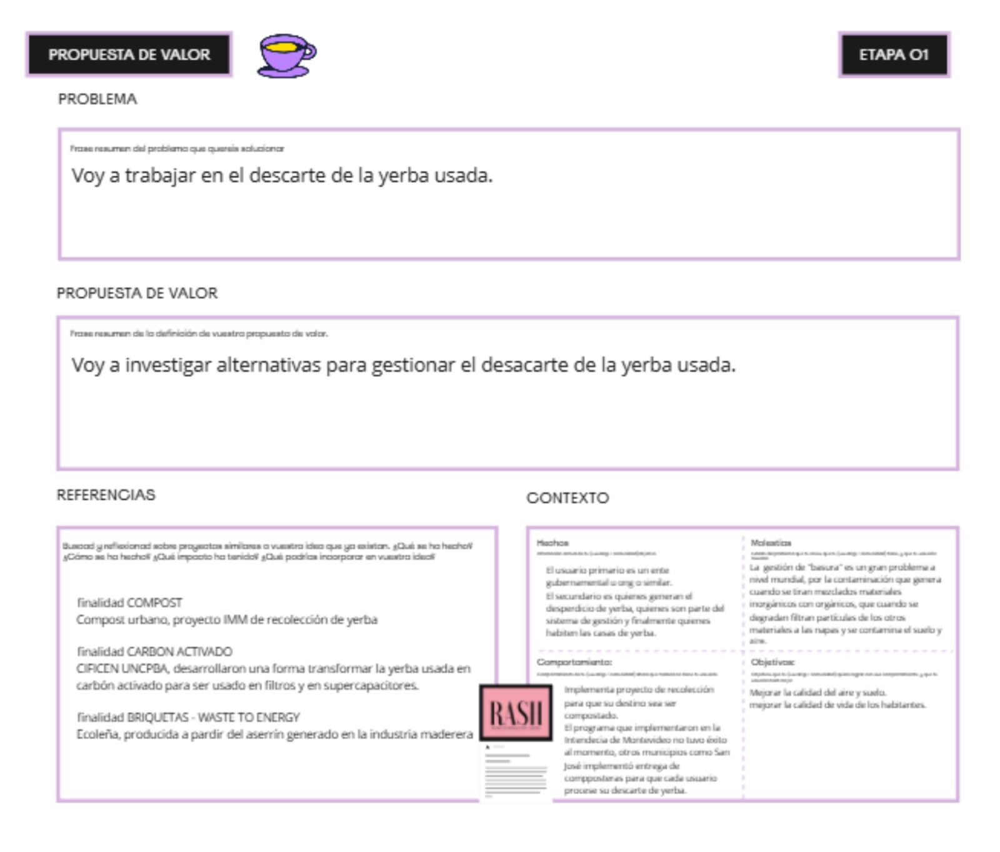
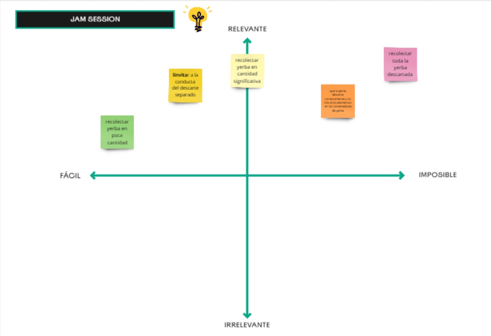
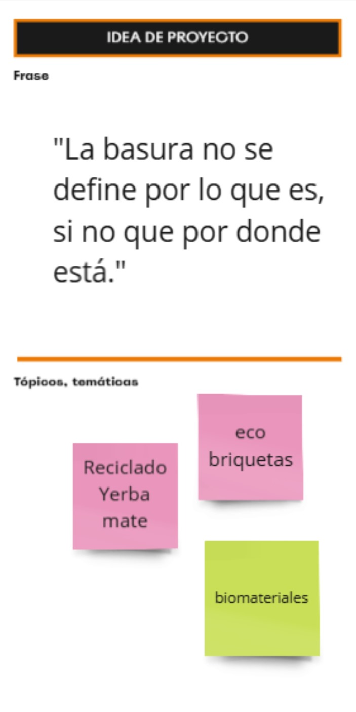
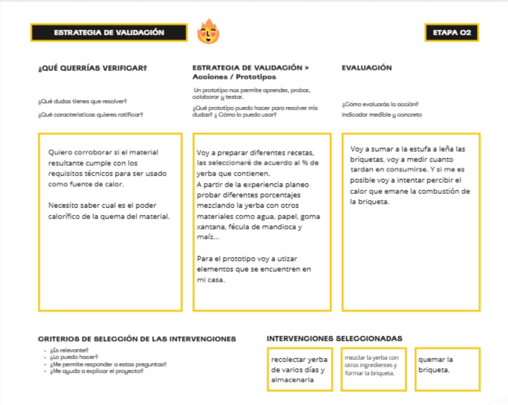

---
hide:
    - toc
---

# MD02 - Proyecto y Diseño

En este módulo siento que ya empezamos a encarar el proyecto final. Los cuadros me permiten organizar la información y las preguntas me desafían a darle palabras a mis ideas para poder comunicarlas.

Esta instanciá me resultó un buen puntapié-reflexión antes de prototipar.

Si queres vistar el canvas y el de mis compañeros: __