---
hide:
    - toc
---

# MD02 - Proyecto y Diseño

Los módulos de diseño (MD) representan una parte integral del eje temático de diseño en el contexto educativo de esta especialización. Estas unidades curriculares están diseñadas para sumergirnos en el fascinante mundo del diseño, abordando una amplia gama de aspectos fundamentales para el desarrollo de proyectos en diversas disciplinas. Al centrarse en el proceso de diseño en su totalidad, los MD ofrecen una experiencia educativa enriquecedora que va más allá de simplemente crear productos o soluciones.

Considero son una oportunidad para explorar y comprender la complejidad del diseño en sus múltiples dimensiones. Desde la conceptualización inicial hasta la implementación final, marcando un viaje de descubrimiento que abarca la interacción entre el proyecto y su entorno, las metodologías de diseño pertinentes (como el Aprendizaje Basado en Proyectos - ABP), la colaboración en el diseño distribuido, el prototipado y la fabricación.

En resumen, los módulos de diseño son mucho más que simples cursos; representan una plataforma dinámica y colaborativa donde podemos desarrollar habilidades fundamentales en diseño, explorar nuevas ideas y enfoques, y prepararse para enfrentar los desafíos del mundo real con confianza y creatividad.

Para el desarrollo del presente vimos diferentes herramientas como lo son: 

{ align=left }

Miro es una aplicación de colaboración en línea que permite a equipos trabajar juntos de manera remota en proyectos creativos, de planificación y de resolución de problemas. La aplicación proporciona una pizarra digital flexible donde los usuarios pueden crear y organizar diversos tipos de contenido, como notas adhesivas, diagramas, dibujos, imágenes y más.

Miro es conocido por su capacidad para facilitar la colaboración en tiempo real, lo que permite que varios usuarios trabajen juntos simultáneamente desde diferentes ubicaciones geográficas. Esto hace que sea una herramienta especialmente útil para equipos distribuidos o aquellos que trabajan de forma remota. En base a esta colaboración en tiempo real, se fuerond desarrollando las diferentes clases, compartiendo el trabajo individual con el grupo de trabajo asignado.

{ align=right }

ChatGPT es parte de la familia de modelos de inteligencia artificial desarrollados por OpenAI, específicamente basado en la arquitectura GPT (Generative Pre-trained Transformer).

El propósito principal del mismo, es entender y generar texto en lenguaje natural para participar en conversaciones y asistir en una variedad de tareas, desde responder preguntas y proporcionar información hasta generar contenido creativo y ayudar en la resolución de problemas. Está entrenado en una amplia gama de temas y tiene acceso a una gran cantidad de conocimientos recopilados de diversas fuentes en línea.

En resumen, es un modelo de inteligencia artificial diseñado para comprender y producir texto humano de manera coherente y relevante, con el objetivo de brindar asistencia y participar en interacciones de manera similar a como lo haría una persona real.

## Proceso Realizado

Primeramente, recibimos una presentación y explicación de Joaquín y Santiago quienes fueron nuestros docentes para el presente módulo, en la primera clase hablamos de diseño y sobre todo de maneras de prototipar, ya en la segunda clase trabajamos con Santi sobre la Propuesta de Valor y nuestras ideas de proyectos.

Primeramente definimos en la Propuesta de Valor, el problema a resolver con el proyecto:

<figure markdown="span">
  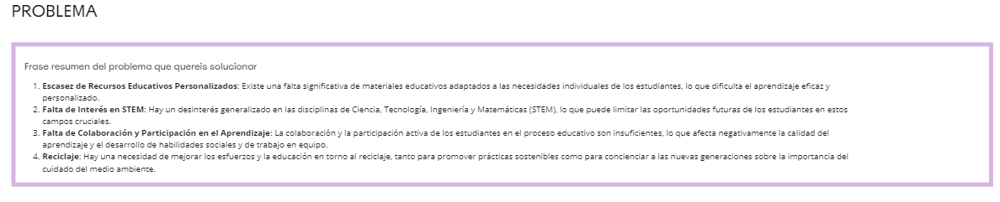{ width="600"}
</figure>

Luego, planteamos una frase o frases que definan la propuesta de valor del proyecto a realizar

<figure markdown="span">
  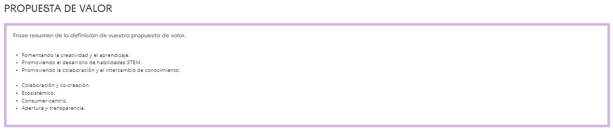{ width="600"}
</figure>

A partir de ellas, busqué referencias sobre proyectos similares que ya existan, para poder constrastar, bajar ideas y reflexionar sobre la idea que tengo del proyecto, buscando responder las preguntas ¿que se ha hecho?, ¿como se ha hecho?, ¿que impacto a tenido? y ¿que podría incluir de estos en mi idea?, aquí encontre varios ejemplos relacionados e interesantes para pensarlos y comparar con mi idea, incluso hay uno que me llamo la atención que es Kenistech.

<figure markdown="span">
  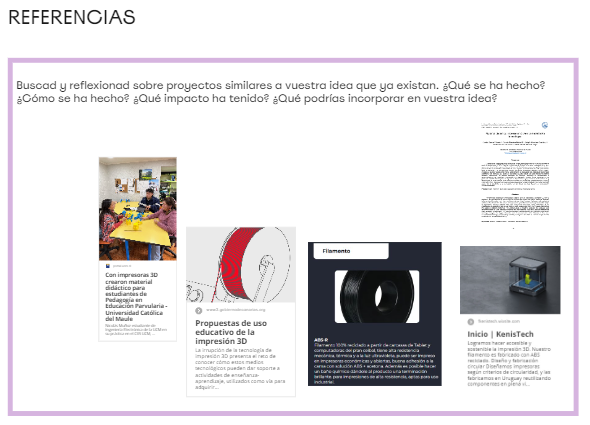{ width="600"}
</figure>

Kenistech es una empresa local, que el porque me llamó la atencion es porque fabrica ABS con materiales reciclados, principalmente con computadoras rotas de Plan Ceibal.

<figure markdown="span">
  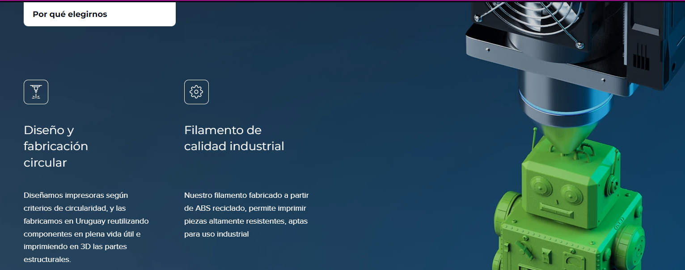{ width="600"}
</figure>

Luego para reforzar el que significan para mí intente contextualizarlas un poco más con un conjunto de caracteristicas donde me permitan ver el concepto "bajado a tierra" en base a Hechos, Molestias, Comportamiento y Objetivos:

<figure markdown="span">
  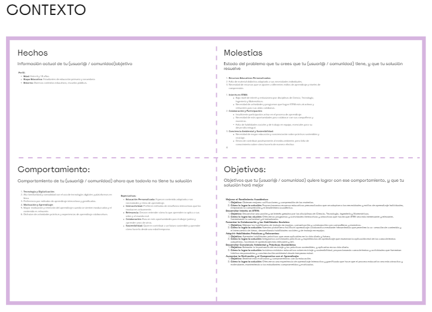{ width="600"}
</figure>

En este momento, pasé a la Jam Session, donde en base a cuatro categorías: Relevante, Fácil, Imposible y Irrelevante, debía incluir actividades relacionadas al proyecto, lo interesante es poder ver la totalidad de las actividades y su relacion con las cuatro áreas: 

<figure markdown="span">
  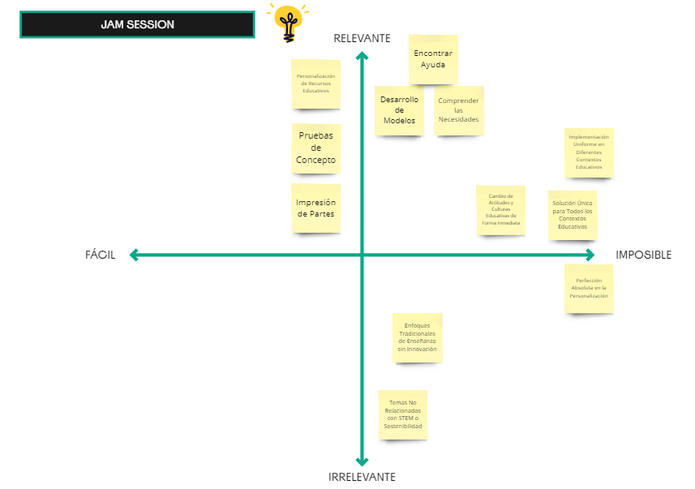{ width="600"}
</figure>

El resultado total del día 1 del módulo resulto de esta manera:

<figure markdown="span">
  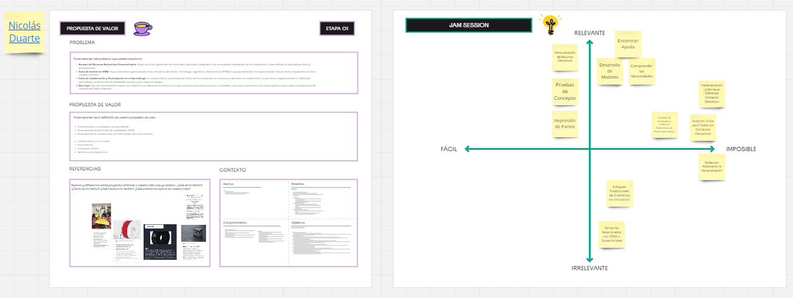{ width="600"}
</figure>

Ya en la siguiente clase, o en el día 2, continuamos trabajando con nuestro proyectos, completando la idea de proyecto y los tópicos y temáticas relacionados al mismo:

<figure markdown="span">
  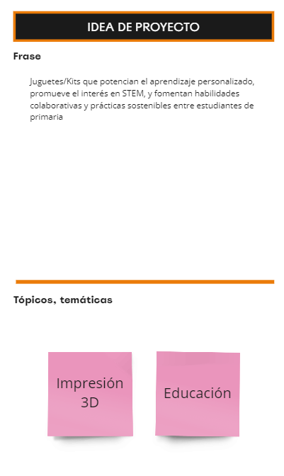{ width="600"}
</figure>

Posteriormente pasamos a la Estrategia de Validación, donde en base a tres cuadrantes con preguntas sobre el proyecto, definieremos dicha estrategia, ellas son: ¿qué quiero verificar?, ¿Que acciones o Prototipos nos permiten validar la idea? y finalmente una Evaluacción sobre las acciones a realizar:

<figure markdown="span">
  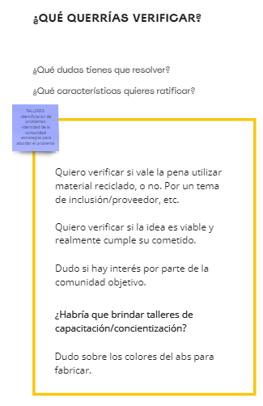{ width="600"}
</figure>

<figure markdown="span">
  { width="600"}
</figure>

<figure markdown="span">
  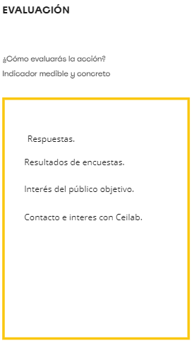{ width="600"}
</figure>

Aquí en la clase nos dividimos en subgrupos para comentar nuestras ideas y entre la sala poder ir contestando las preguntas planteadas de cada uno de los proyectos, en el caso de nuestra sala, el tiempo fue tirano, ya que nos pusimos a charlar sobre nuestros proyectos para interiorizarnos entre nosotros. Lo bueno que si bien no pudimos definir muchas partes de la estrategia de validación tuvimos un ida y vuelta de ideas que estuvo muy interesante y rico para el proyecto final. Santiago también participo de la charla.

Con lo tomado de la charla y mi idea, me propuse a ir completando todo el trabajo para poder terminarlo y poder evaluar la estrategia, resultandome lo siguiente:

<figure markdown="span">
  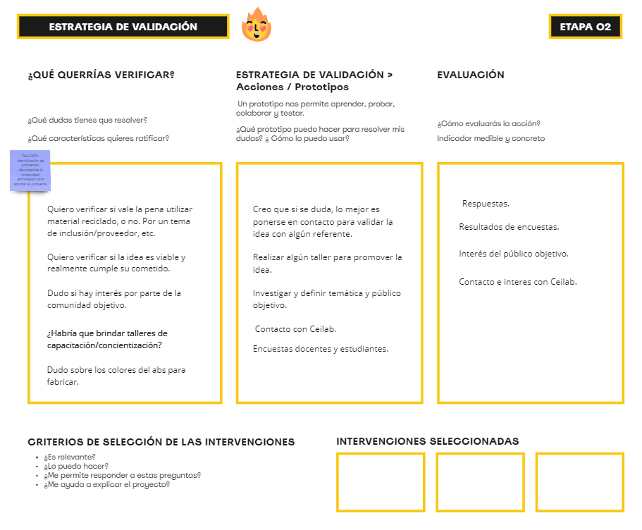{ width="600"}
</figure>

Finalizando, entiendo esta manera de enfrentar el desafío de dar forma a una solución para un proyecto es sumamente útil, ya que si bien abarca algunas especificidades hacia cada proyecto/idea, también tiene un efoque global, aplicable a cualquier proyecto lo cual considero muy interesante y positivo.
Me ayudó a interconectar conceptos, a dar guias por donde seguir el proyecto y el cómo hacerlo.

## Miro Realizado: *[@md02-efdi](https://miro.com/app/board/uXjVK9Q-_oY=/)*
