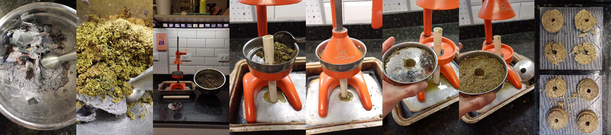
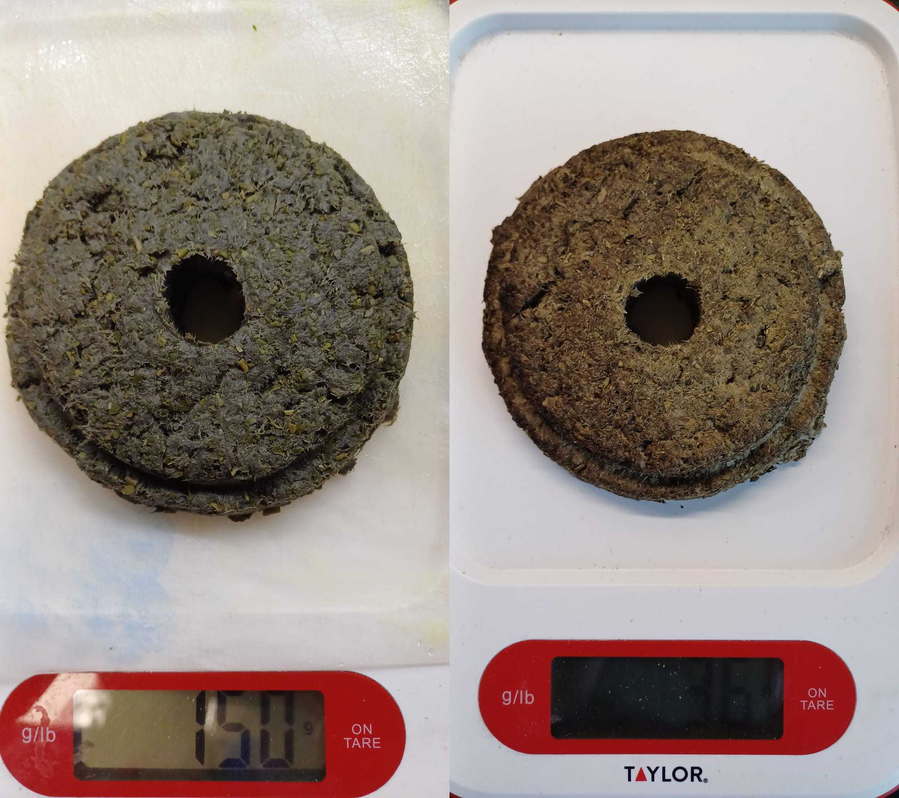
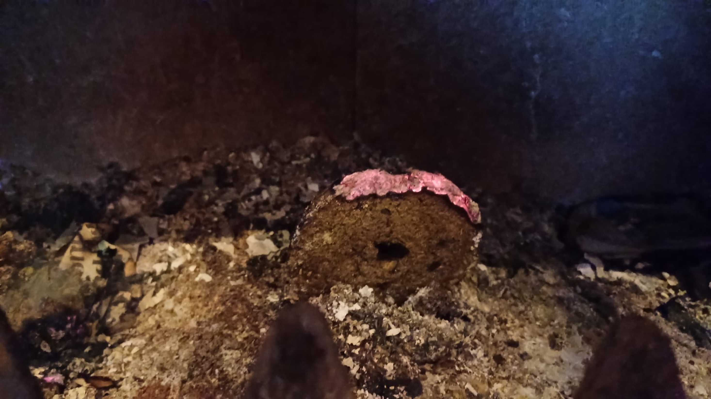

---
hide:
    - toc
---

# MD03 - Prototipado y Fabricación

Para este módulo probé una receta de internet de eco briqueta hecha a partir de aserrín:

## Ingredientes y proporciones utilizadas:

800ml de agua
722 grs de pulpa de papel húmedo (papel triturado después de haber estado en agua por más de 24 hrs)
490 grs de yerba húmeda (la yerba se recolectó en un contenedor y se conservó en la heladera)

## Resultado:

Un material que llama la atención su peso ligero y alta resistencia. La pieza prototipada pasaó de pesar 150grs salido de la prensa a 36 grs una vez seco. En esta ocación se lo secó en una disecadora.

Al hacer la prueba de combustión, no cumplió la expectativa de que prenda llama, apenas hizo brasa. Llegué a la conclusión de que el papel mojado actúa como agente retardante.

## Reflexión:

Siendo que el material logrado presenta dos características interesantes: resistencia y liviandad. Voy a redireccionar el proyecto hacia otro nicho: eco ladrillos y/o aislante sonoro.

Si queres vistar el canvas y el de mis compañeros: _