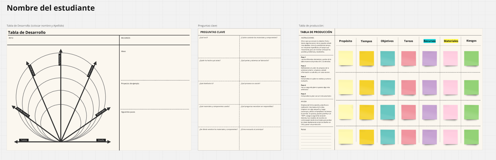
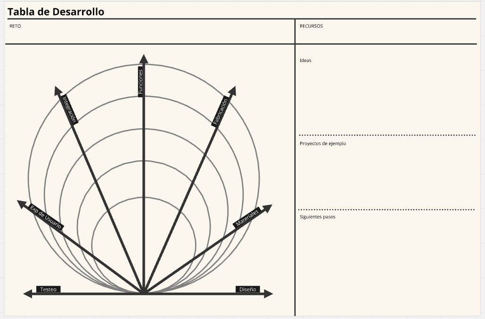
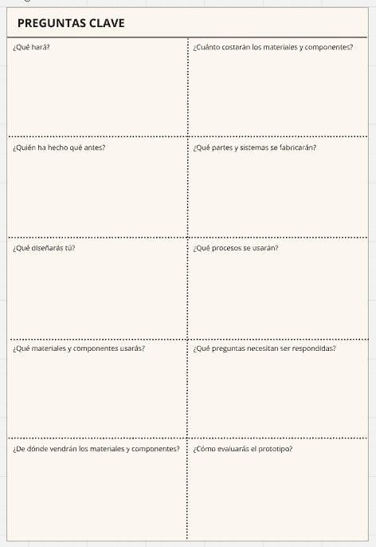
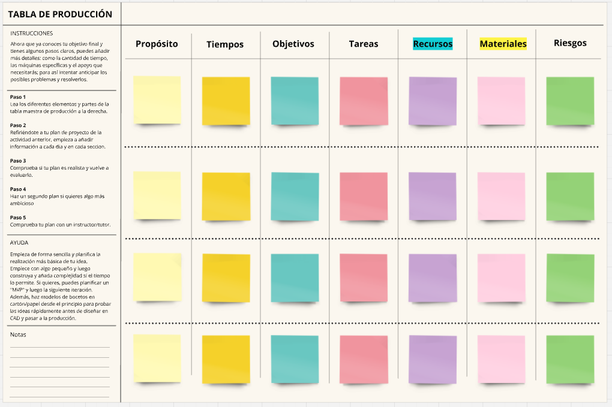
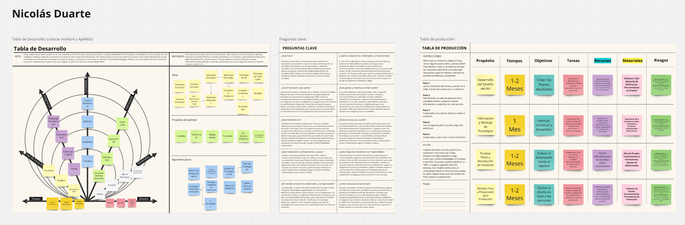
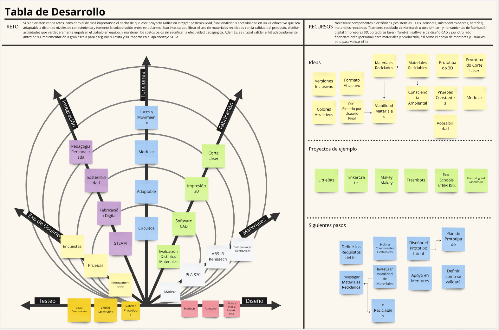
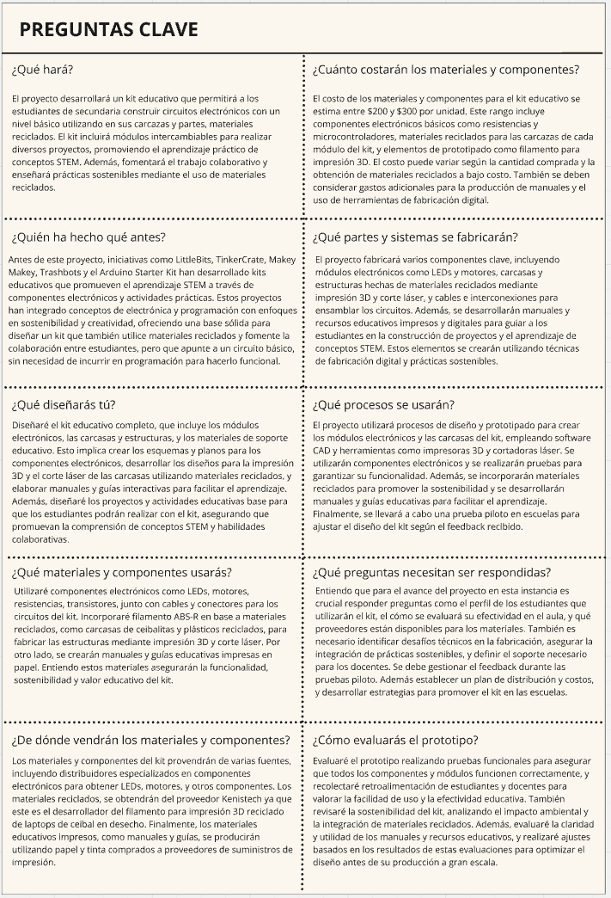
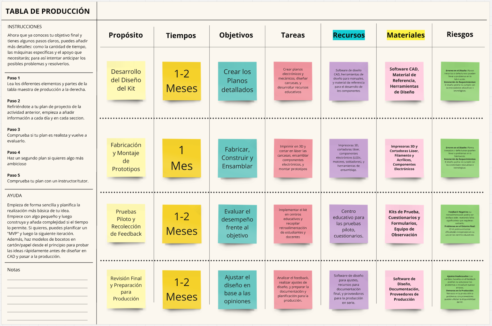

---
hide:
    - toc
---

# MD03 - Prototipado y Fabricación

Los módulos de diseño (MD) representan una parte integral del eje temático de diseño en el contexto educativo de esta especialización. Estas unidades curriculares están diseñadas para sumergirnos en el fascinante mundo del diseño, abordando una amplia gama de aspectos fundamentales para el desarrollo de proyectos en diversas disciplinas. Al centrarse en el proceso de diseño en su totalidad, los MD ofrecen una experiencia educativa enriquecedora que va más allá de simplemente crear productos o soluciones.

Considero son una oportunidad para explorar y comprender la complejidad del diseño en sus múltiples dimensiones. Desde la conceptualización inicial hasta la implementación final, marcando un viaje de descubrimiento que abarca la interacción entre el proyecto y su entorno, las metodologías de diseño pertinentes (como el Aprendizaje Basado en Proyectos - ABP), la colaboración en el diseño distribuido, el prototipado y la fabricación.

En resumen, los módulos de diseño son mucho más que simples cursos; representan una plataforma dinámica y colaborativa donde podemos desarrollar habilidades fundamentales en diseño, explorar nuevas ideas y enfoques, y prepararse para enfrentar los desafíos del mundo real con confianza y creatividad.

Para el desarrollo del presente vimos diferentes herramientas como lo son: 

{ align=left }

Miro es una aplicación de colaboración en línea que permite a equipos trabajar juntos de manera remota en proyectos creativos, de planificación y de resolución de problemas. La aplicación proporciona una pizarra digital flexible donde los usuarios pueden crear y organizar diversos tipos de contenido, como notas adhesivas, diagramas, dibujos, imágenes y más.

Miro es conocido por su capacidad para facilitar la colaboración en tiempo real, lo que permite que varios usuarios trabajen juntos simultáneamente desde diferentes ubicaciones geográficas. Esto hace que sea una herramienta especialmente útil para equipos distribuidos o aquellos que trabajan de forma remota. En base a esta colaboración en tiempo real, se fuerond desarrollando las diferentes clases, compartiendo el trabajo individual con el grupo de trabajo asignado.

## Proceso Realizado

Para este trabajo realizamos una actualización, con diferentes puntos extra de cara a el Poryecto Final de la EFDI, donde utilizos como base lo realizado en el módulo anterior: el MD02.
Para ello se nos presentó un nuevo tablero, donde nos encontramos con la consigna de completarlo en base a nuestra idea para implementar en el Proyecto Final.

El mismo se compone por la siguiente estructura general:

<figure markdown="span">
  { width="600"}
</figure>

La misma se subdivide en tres segmentos o tres tablas:

La tabla de Desarrollo

<figure markdown="span">
  { width="600"}
</figure>

La tabla de Preguntas Clave

<figure markdown="span">
  { width="600"}
</figure>

La tabla de Producción

<figure markdown="span">
  { width="600"}
</figure>

Con lo tomado de la clase y mi idea para el Proyecto Final, me propuse a ir completando todo el trabajo para poder terminarlo y poder evaluar la totalidad del mismo en base a las tres tablas, resultandome lo siguiente:

<figure markdown="span">
  { width="600"}
</figure>

<figure markdown="span">
  { width="600"}
</figure>

<figure markdown="span">
  { width="600"}
</figure>

<figure markdown="span">
  { width="600"}
</figure>

Finalizando, entiendo esta manera de enfrentar el desafío de dar forma a una solución para un proyecto es sumamente útil, ya que si bien abarca algunas especificidades hacia cada proyecto/idea, también tiene un efoque global, aplicable a cualquier proyecto lo cual considero muy interesante y positivo.
Me ayudó a interconectar conceptos, a dar guias por donde seguir el proyecto y el cómo hacerlo.

## Miro Realizado: *[@md03-efdi](https://miro.com/app/board/uXjVKlm1tIk=/)*
