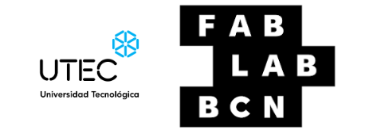

# Inicio

[sobre-mi]: https://pilargo.github.io/efdi2024PilarGo/about/me/

## Bitácora EFDI 2024

Mi nombre es Pilar García Olano, en esta web voy a registrar los altibajos de mi experiencia en la cursada de la Especialización en fabricación Diegital e Innovación 2024 de Utec y Fab Lab Bcn.
Quiero agradecer la oportunidad de volver a estudiar (formalmente) después de casi 10 años, agradecer a los profesores y a mis compañeros que compartieron sus experiencias e iluminaron mis ignorancias.

En la cursada me resultó especialmente dificil la parte de programación, agradezco especialmente a quienes con paciencia y esperanza me ayudaron.

Para conocerme un poco más podes visitar este link [Sobre mí.][sobre-mi]

Para saber en qué estuve trabajando este año, te invito a vistar la sección de Proyecto Integrador [Ir a Proyecto Integrador](#proyecto-integrador)

Gracias por tu tiempo, y si tenés alguna sugerencia te agradezco si me podes contactar: [Enviar correo a Pilar](mailto:pilargarciaolano@gmail.com)

<figure markdown="span">
  { width="400"}
</figure>
