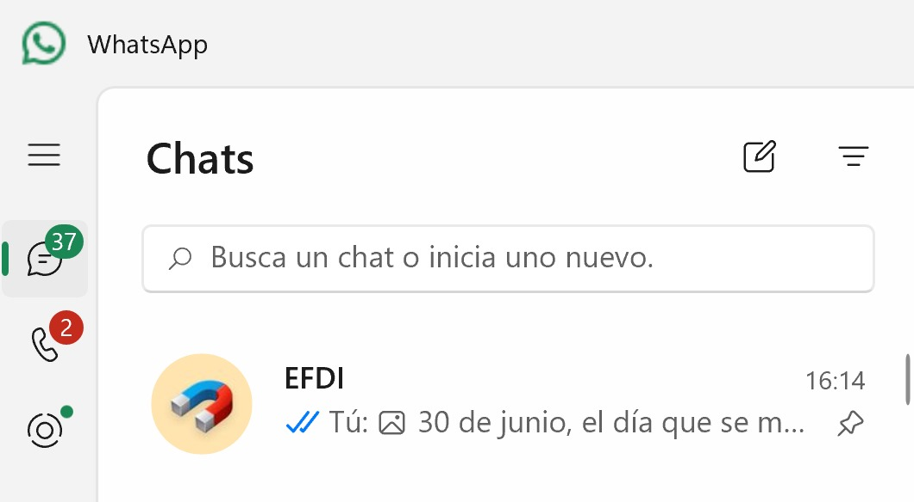

# Inicio

[sobre-mi]: https://pilargo.github.io/efdi2024PilarGo/about/me/

## Bitácora EFDI 2024

Mi nombre es Pilar García Olano, en esta web registro los altibajos de mi experiencia en la cursada de la Especialización en fabricación Diegital e Innovación 2024 de Utec y Fab Lab Bcn.
Quiero agradecer a Utec y Fab Lab la oportunidad de volver a estudiar (formalmente) después de casi 10 años, agradecer a los profesores y a mis compañeros que compartieron sus experiencias e iluminaron mis ignorancias.

Un gracias especial a Martín y a mis hijas Uma y Zoe que se bancaron y acompañaron los efectos colaterales de mi cursada. Otro gracias a Inés que me invitó a sumarme a este baile.

Para registrar mi camino generé un chat conmigo misma en whatsapp donde registraba experencias y tomaba notas de cosas que me parecían relevantes. El recurso me resultó práctico porque de esta forma también me quedaba registrado la fecha.

En la cursada me resultó especialmente dificil la parte de programación, agradezco especialmente a quienes con paciencia y esperanza me ayudaron. Mis gracias especiales a María, Mathias, Nicolás, Edgardo, Victoria y Franco.

Para conocerme un poco más podes visitar este link [Sobre mí.][sobre-mi]

Otro gran desafío de esta cursada era unificar todos los temas en un trabajo final, después de muchas vueltas desarrollé una propuesta de Gestión para transformar la yerba descartada en ladrillos, para conocer de qué va te invito a vistar la sección Proyecto Integrador [Ir a Proyecto Integrador](#proyecto-integrador)

Gracias por tu tiempo, y si tenés alguna sugerencia te agradezco si me podes contactar: [Enviar correo a Pilar](mailto:pilargarciaolano@gmail.com)

<figure markdown="span">
  { width="400"}
</figure>
