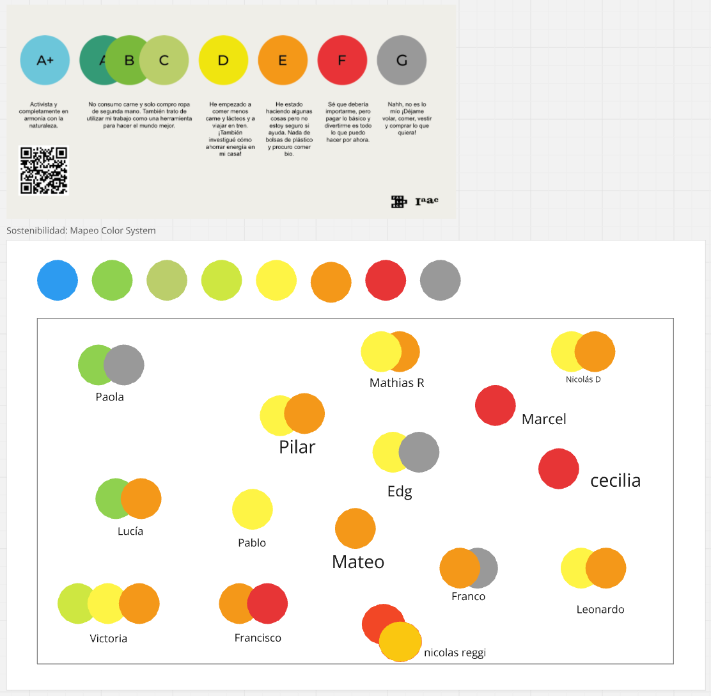
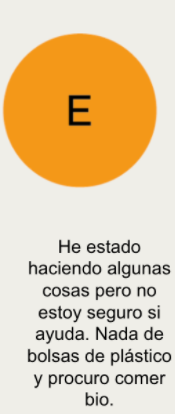
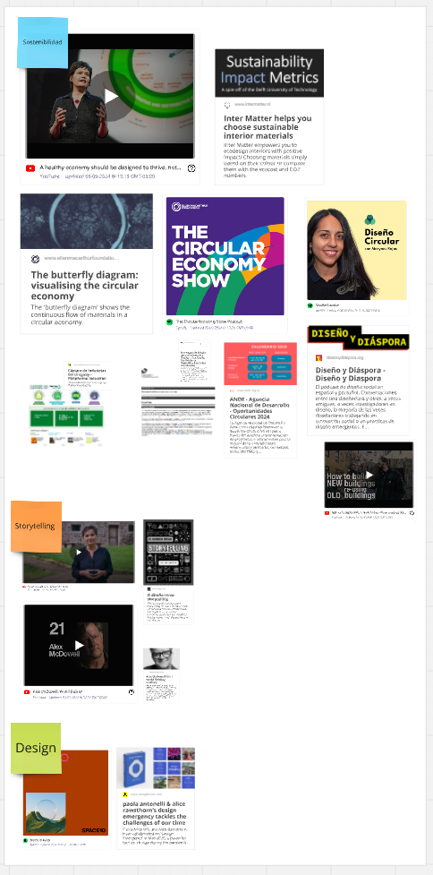
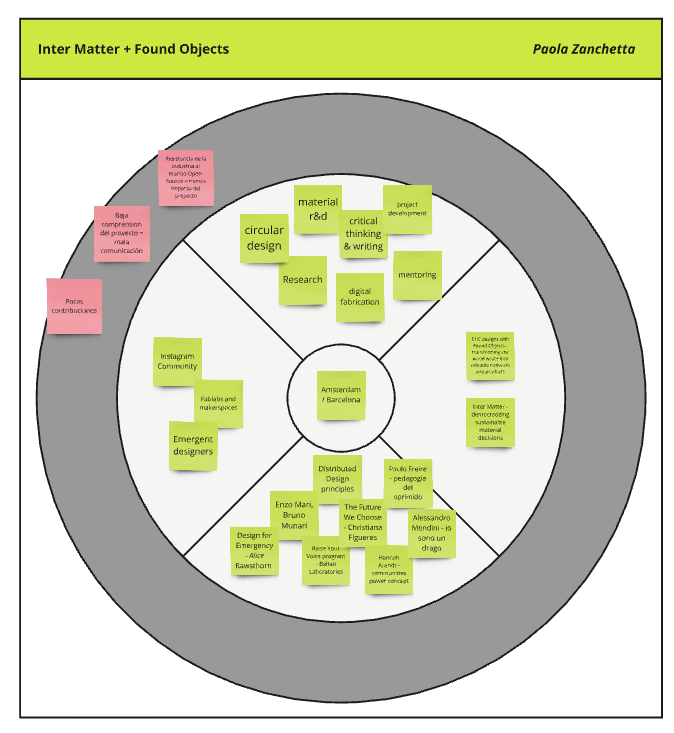
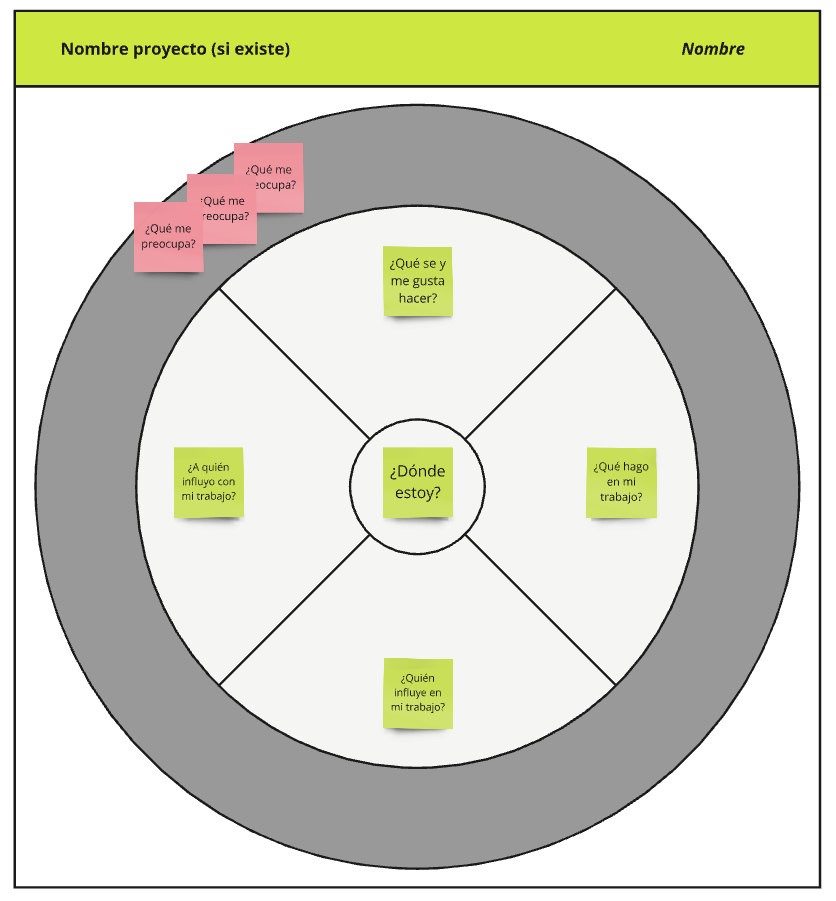
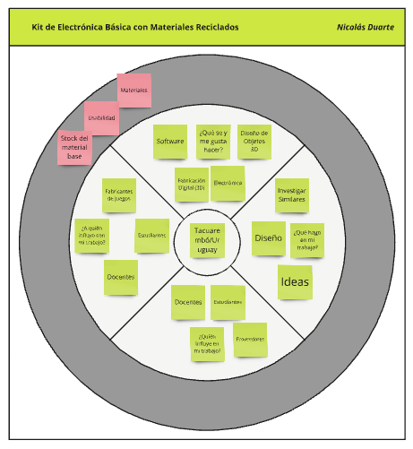
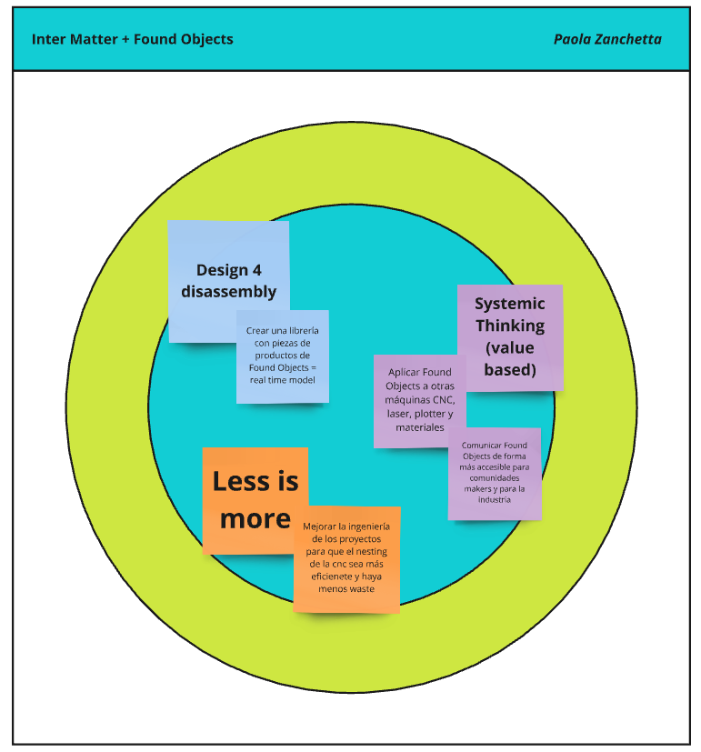
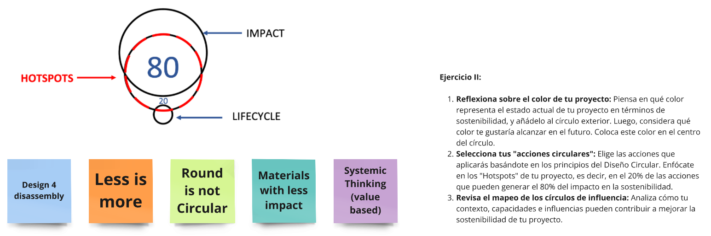
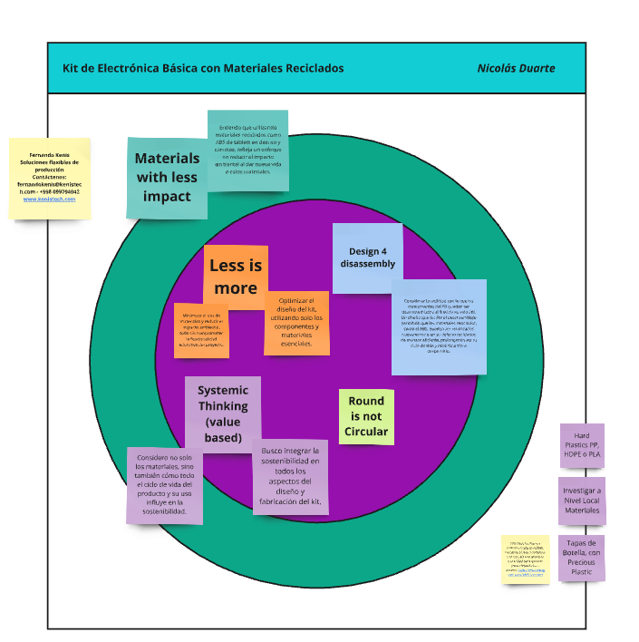

---
hide:
    - toc
---

# MI02 - Desarrollo Sostenible y Economia Circular

## Introducción

Dentro de la Especialización en Fabricación Digital e Innovación, el enfoque en la innovación y la sostenibilidad es fundamental. Esta especialización incluye una serie de módulos dedicados a explorar y aplicar metodologías innovadoras con un fuerte compromiso hacia la sostenibilidad. En particular, se aborda la sostenibilidad de manera integral, considerando sus dimensiones social, económica y ambiental. Esto nos permite, como estudiantes, desarrollar soluciones innovadoras que no solo sean efectivas, sino también responsables y sostenibles a largo plazo.

El Módulo MI02 se centra en el Desarrollo Sostenible y la Economía Circular. Aquí, documentamos las actividades, metodologías y aprendizajes obtenidos, con el objetivo no solo de registrar el proceso, sino también de reflexionar sobre cómo aplicar estas metodologías en la práctica y su impacto en las distintas dimensiones de la sostenibilidad.

A lo largo del módulo, trabajamos en conjunto con nuestra docente, Paola, en una serie de sesiones por videoconferencia. Para facilitar la colaboración, utilizamos Miro, una herramienta que nos permitió trabajar en tiempo real y compartir nuestras ideas con el equipo. Miro es una plataforma en línea que funciona como una pizarra digital flexible, donde podemos organizar y visualizar diferentes tipos de contenido: desde notas adhesivas hasta diagramas y dibujos, lo que fue clave para nuestras dinámicas de trabajo remoto.

{ align=left }

Miro es una aplicación de colaboración en línea que permite a equipos trabajar juntos de manera remota en proyectos creativos, de planificación y de resolución de problemas. La aplicación proporciona una pizarra digital flexible donde los usuarios pueden crear y organizar diversos tipos de contenido, como notas adhesivas, diagramas, dibujos, imágenes y más.

Miro es conocido por su capacidad para facilitar la colaboración en tiempo real, lo que permite que varios usuarios trabajen juntos simultáneamente desde diferentes ubicaciones geográficas. Esto hace que sea una herramienta especialmente útil para equipos distribuidos o aquellos que trabajan de forma remota. En base a esta colaboración en tiempo real, se fuerond desarrollando las diferentes clases, compartiendo el trabajo individual con el grupo de trabajo asignado.

## Proceso Realizado

Comenzamos con una introducción teórica impartida por Paola, en la que nos presentó un sistema de mapeo de colores relacionado con la sostenibilidad. Cada color representaba distintos grados de compromiso o hábitos sostenibles, desde el azul A+ hasta el gris G. La tarea consistía en reflexionar sobre nuestras propias prácticas sostenibles y ubicarnos dentro de ese espectro.

Este ejercicio fue particularmente interesante, ya que nos permitió detenernos a pensar en nuestro propio nivel de compromiso con la sostenibilidad y nos llevó a discusiones valiosas sobre cómo cada uno de nosotros podía mejorar en áreas como la economía circular, el reciclaje o la adopción de hábitos más responsables.

<figure markdown="span">
  { width="800"}
</figure>

En mi caso, mi "mapeo" de sostenibilidad mostró que me encuentro en una etapa intermedia. Los colores que siento que me representan son el amarillo y el naranja, lo que indica que he comenzado a adoptar ciertos hábitos más sostenibles, pero aún me falta avanzar hacia un compromiso más profundo. Este ejercicio me hizo reflexionar sobre qué más puedo hacer para cuidar el medio ambiente y contribuir a una economía circular más sólida.

El color amarillo sugiere que estoy tomando decisiones conscientes, como reducir el consumo de carne o comenzar a interesarme por prácticas ecológicas, pero aún no las he integrado completamente en mi vida cotidiana. Por otro lado, el color naranja refleja que he empezado a hacer algunos cambios más significativos, pero todavía me falta avanzar hacia un compromiso más profundo con la sostenibilidad.

Este ejercicio me ayudo mucho a reflexionar sobre mi rol en el cuidado del medio ambiente y en qué áreas puedo ser más proactivo para contribuir a una economía circular más robusta.

<figure markdown="span">
  { width="800"}
</figure>

<figure markdown="span">
  { width="800"}
</figure>

<figure markdown="span">
  { width="800"}
</figure>

Luego la profesora y alguno de nosotros compartimos recursos/materiales sobre distintas vertientes relevantes a la temática, como pueden ser Sostenibilidad, Diseño Circular, Storytelling y Diseño.

<figure markdown="span">
  { width="800"}
</figure>

## Ejercicio 1:

Luego, compartimos materiales y recursos sobre temas clave como sostenibilidad, diseño circular, storytelling y diseño. Esto nos ayudó a complementar el conocimiento y a aplicarlo a nuestras ideas de proyectos.

<figure markdown="span">
  { width="800"}
</figure>

<figure markdown="span">
  { width="800"}
</figure>

El ejercicio consistió en mapear diferentes elementos clave relacionados con un proyecto de investigación o diseño basado en la sostenibilidad, la economía circular, y el trabajo colaborativo, mientras se analizan los desafíos enfrentados. Esto entiendo nos ayuda a visualizar cómo se interconectan diversas disciplinas y contribuyentes, y a identificar áreas que necesitan mayor atención o solución de problemas.
En mi caso, aplicando el ejercicio a mi idea resultó lo siguiente:

<figure markdown="span">
  { width="800"}
</figure>

Al aplicar este ejercicio a mi proyecto final de la EFDI, me ayuda a visualizar de manera más clara las conexiones entre los diferentes elementos que forman parte de mi proyecto y los desafíos que puedo enfrentar. El mapeo de conceptos como el diseño circular, la investigación y desarrollo de materiales, y la fabricación digital se alinean perfectamente con mis objetivos de crear un kit educativo a partir de materiales reciclados. Este ejercicio no solo me permite identificar las áreas clave que debo fortalecer, sino también reflexionar sobre los obstáculos, como la comunicación y la colaboración con la comunidad, que podrían estar limitando el impacto del proyecto.

Al observar los retos identificados, me doy cuenta de que el éxito del proyecto no depende únicamente de mi capacidad técnica o de los recursos disponibles, sino también de la manera en que logro involucrar a los demás y comunicar el valor del proyecto.

Impulsa a pensar de manera más estratégica, no solo en los aspectos técnicos, sino también en los elementos sociales y colaborativos que pueden marcar la diferencia en la implementación exitosa del proyecto. Me llevo una reflexión importante: la innovación no es solo lo que creamos, sino cómo lo hacemos y quiénes están involucrados en el proceso.

## Ejercicio 2:

Para el segundo ejercicio, con un enfoque en acciones circulares, realizamos la aplicación de lo que se nos compartió, una base de este mismo ejercicio aplicado a un proyecto de Paola, llamado Inter Matter + Found Objects en conjunto con un template, entonces tomamos esta base para aplicarlo en nuestra idea de proyecto final para EFDI.

<figure markdown="span">
  { width="800"}
</figure>

<figure markdown="span">
  { width="800"}
</figure>

Como podemos observar, los pasos son claros, primero tuve que reflexionar sobre el color que representaba el estado actual de mi proyecto en términos de sostenibilidad. Me tomé un momento para pensar en cómo veía mi proyecto en este momento y elegí un color que simbolizara esa situación. Decidí añadir este color al círculo exterior para visualizar mejor el punto de partida. Luego, pensé en el futuro y en lo que quería alcanzar. Seleccioné otro color que reflejara la sostenibilidad a la que aspiro llegar, y lo coloqué en el centro del círculo, estableciendo así una meta visual.

Después, pasé a la segunda parte, que consistía en seleccionar mis "acciones circulares". Aquí tuve que basarme en los principios del Diseño Circular para elegir las acciones que considero más importantes. Me enfoqué en identificar los "Hotspots" de mi proyecto, que son ese 20% de acciones que pueden generar el 80% del impacto en la sostenibilidad. Esto me ayudó a priorizar mis esfuerzos en aquellas actividades que realmente marcarán una diferencia significativa.

Finalmente, revisé el mapeo de los círculos de influencia. Analicé mi contexto, mis capacidades y las influencias que puedo ejercer para mejorar la sostenibilidad de mi proyecto. Esta parte fue clave, ya que me permitió identificar con claridad cómo puedo contribuir desde mi posición para impulsar un cambio positivo en el proyecto.

Aplicando la consigna a mi proyecto, resultó  de la siguiente manera:

<figure markdown="span">
  { width="800"}
</figure>

Comencé por reflexionar sobre el estado actual de mi proyecto, un kit de electrónica básica elaborado con materiales reciclados. Pensé en cómo se encuentra el proyecto en términos de sostenibilidad y seleccioné el color verde para el círculo exterior, ya que representa un enfoque que apenas está comenzando a ser consciente del impacto ambiental y que tiene margen para mejorar. Luego, para el centro del círculo, elegí un tono morado, un color que refleja la visión de futuro en la que aspiro alcanzar una mayor integración de prácticas circulares y sostenibles.

En la siguiente parte, tuve que seleccionar mis "acciones circulares" basándome en los principios del Diseño Circular. Identifiqué las áreas clave, o "Hotspots", que podrían generar un cambio significativo en la sostenibilidad de mi proyecto. Opté por varias acciones, como "Materials with less impact", donde busco utilizar materiales reciclados y de menor impacto ambiental, y "Less is more", enfocándome en optimizar el diseño del kit utilizando solo los componentes esenciales. Además, incorporé el principio de "Design 4 disassembly" para que el kit sea fácil de desmontar al final de su vida útil, facilitando la reutilización o reciclaje de sus partes. También consideré la importancia de "Systemic Thinking (value based)" para integrar la sostenibilidad en todos los aspectos del diseño y fabricación del kit. Todo esto quedó reflejado en los post-its dentro del círculo, representando el enfoque integral que planeo adoptar.

Finalmente, revisé el mapeo de los círculos de influencia. Analicé cómo los materiales disponibles, la tecnología que puedo usar y el contexto local en el que se desarrollará el proyecto podrían impactar en su sostenibilidad. Incluí notas sobre la investigación de materiales locales y el uso de plásticos reciclados, como PP, HDPE o PLA. Este análisis me ayudó a visualizar cómo puedo enfocar mis esfuerzos para lograr un producto más sostenible y circular.

## Reflexión:

Este módulo me permitió repensar el impacto que nuestras decisiones tienen en el medio ambiente y la sociedad. Entendí que la sostenibilidad no es solo una opción, sino una responsabilidad que debemos asumir como diseñadores, innovadores y ciudadanos. El concepto de economía circular, en particular, me inspiró a explorar soluciones que promuevan un ciclo de vida de productos que minimice residuos y maximice el uso de recursos.

Lo más valioso de esta experiencia fue la oportunidad de aplicar estos principios en mi propio proyecto. Me llevo herramientas que no solo me permitirán diseñar de manera más consciente, sino también generar un impacto positivo en mi entorno y en las futuras generaciones. Este es solo el comienzo de un camino hacia un enfoque más sostenible e innovador.
