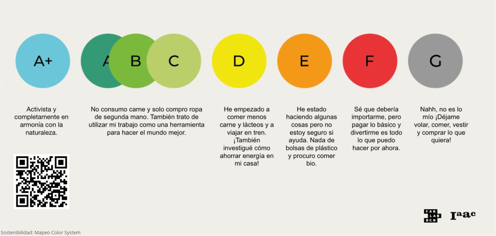
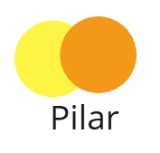
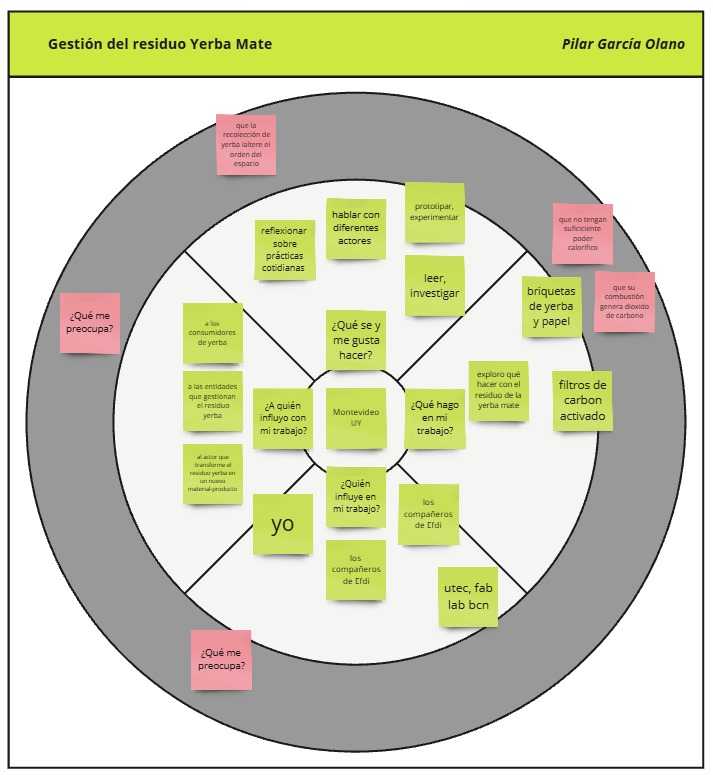
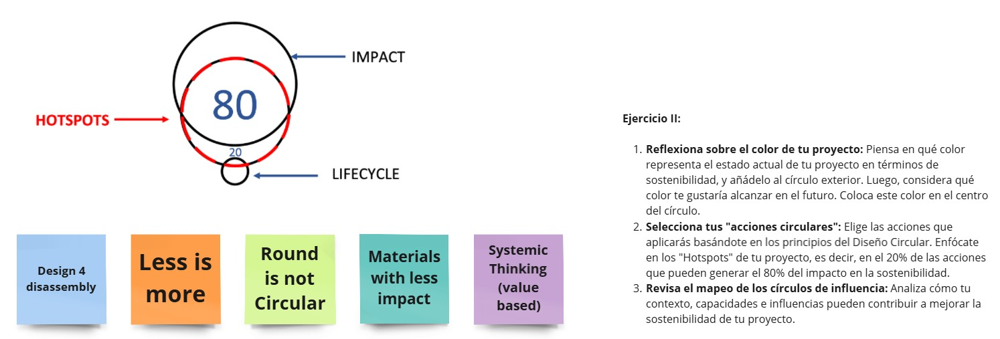
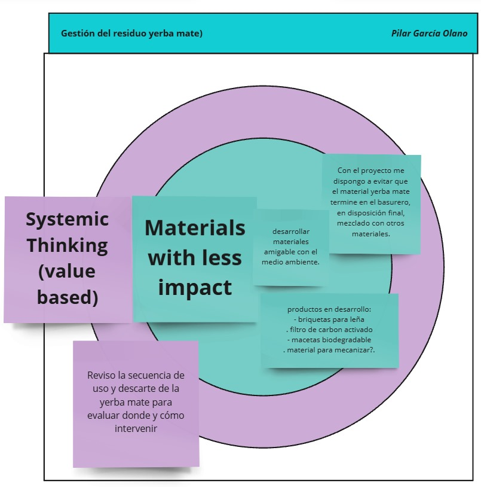

---
hide:
    - toc
---

# MI02 - Desarrollo Sostenible y Economía Circular

Estos son lo módulos que más disfruté, disfruto de conocer nuevos proyectos e intercambiar datos. No dejjo de sorprenderme con las cosas que se hace. El tema de este módulo me interesa especialmente, no es casual que mi proyecto surje en este contexto de búsqueda de sostenibilidad. 

A contianuación comparto los ejercicios que hicimos durante la clase en el tablero Miro.

Reflexión - Conclusión:

Estas instancias me resultan un buen momento para procesar el tema que uno está analizando, rumiarlo para después iterar el proyecto.

Muchas gracias por esta herramienta!

