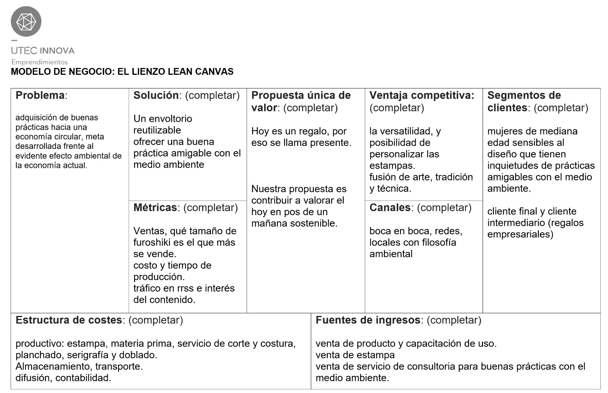

---
hide:
    - toc
---
# Emprendimiento

Este módulo me gustó tanto que seguí con la preincubación con mi proyecto de furoshikis.

Hice los siguientes test para conocer mis perfil emprendedor, mis fortalezas y debilidades. Y el Lean Canvas del emprendimiento.

[Test inteligencias multiples](../archivos/mi03_test_inteligencias_multiples_pgo.pdf)

[Test de carcterística del comportamiento emprendedor](../archivos/mi03_testCCE_pgo.pdf)

## Conslusiones - Reflexiones

Esta instancia me resultó muy interesante para identificar mi perfil emprendedor y seguir trabajandolo.

También creo que este módulo me distrajo del foco del EFDI, y sobre todo cuando decidí seguir con la preincubación. 

