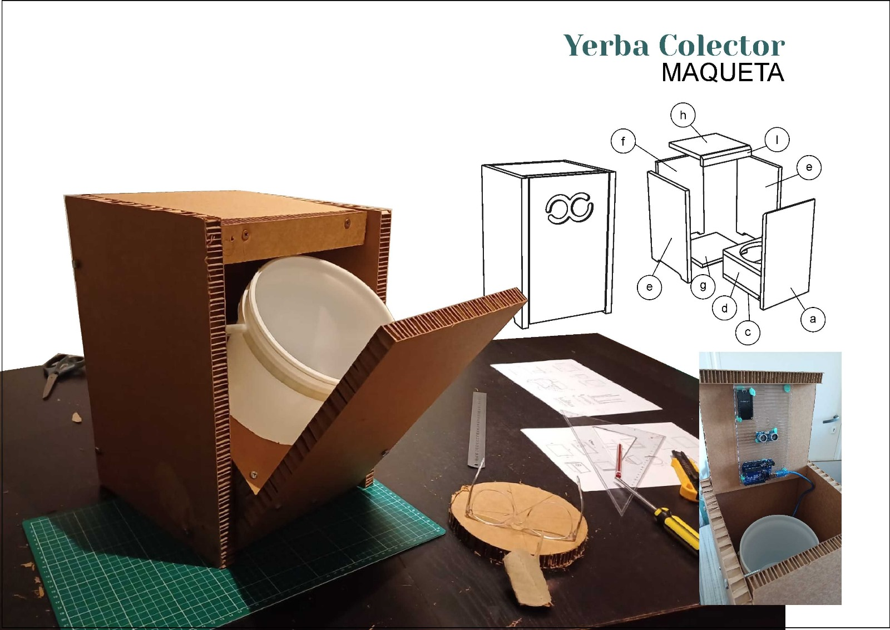
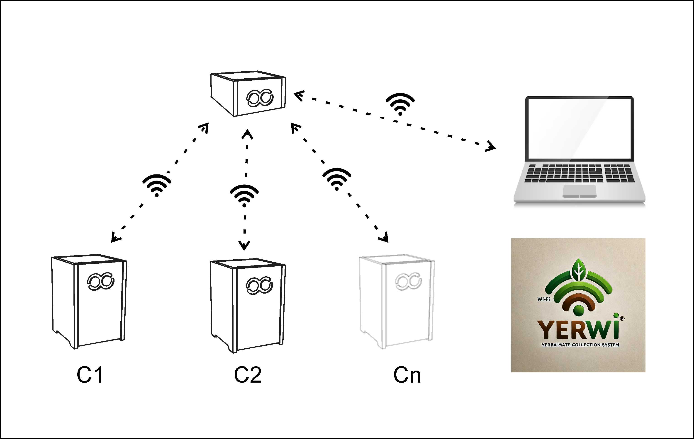
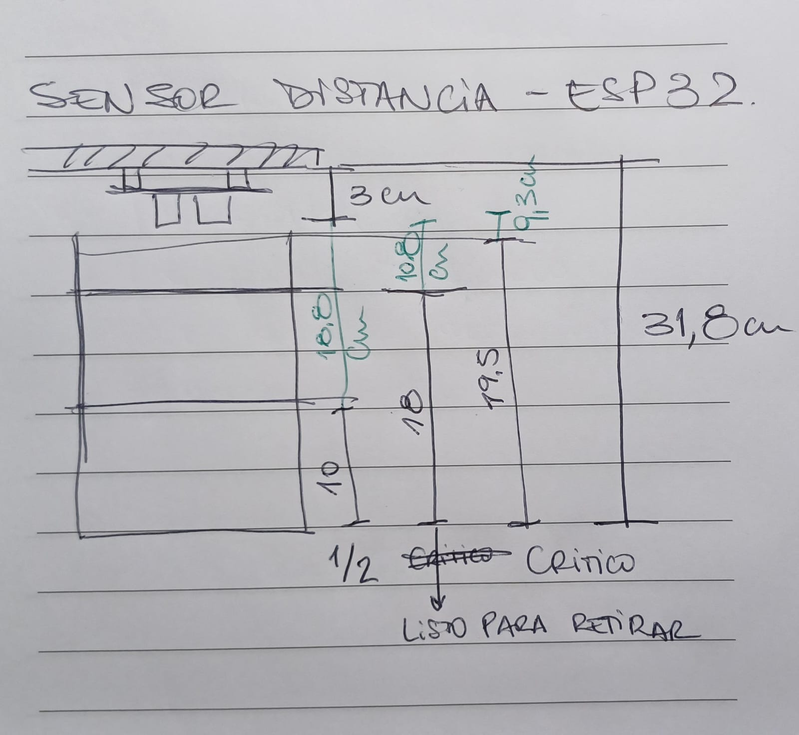
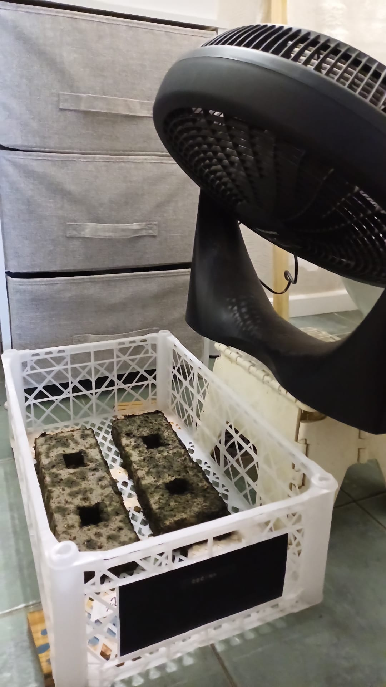
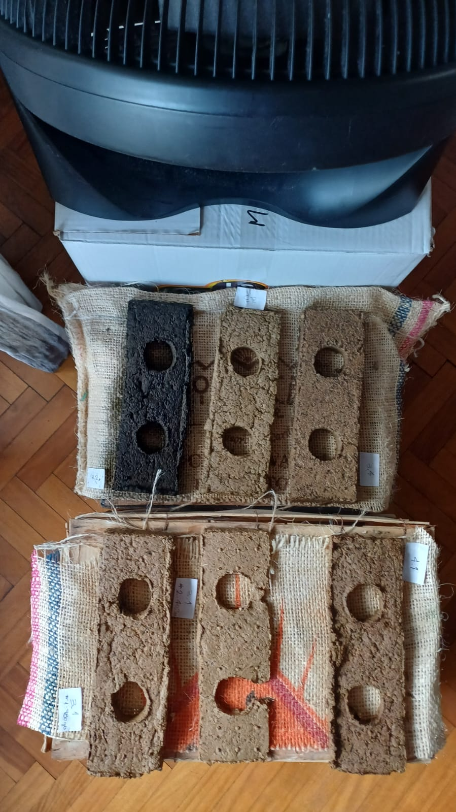

---
hide:
    - toc
---

# Proyecto Final: Me propongo desarrollar un Sistema de Gestión para transformar el residuo yerba mate en ladrillos para la construcción y paneles acústicos. 

Una vez que definí que el objetivo del proyecto va a ser el desarrollo de un ladrillo cuyo componente principal, en la medida de lo posible, sea yerba descartada surgieron nuevas preguntas:

Cual va a ser la composición del ladrillo?
Cómo se va a fabricar?
Qué forma va a tener?

Pero no solo tenía que pensar el producto final "ladrillo" también tenía quería definir de qué forma es que iba a recolectar la yerba descartada. Asi que más preguntas surgieron:
Donde se genera la yerba descartada?
Quien la genera?
Vale la pena apuntar a todos los lugares donde se origina el residuo o solo a los de mayor volumen?
Quien va a recolectar la yerba? Qué se hace después con la recolección?
Qué características necesito en el objeto recolector?

y a todo esto como incluir los conceptos aprendidos a lo largo de la cursada EFDI 2024.

**Objetivos a desarrollar:**
-	**Planos para construir el contenedor recolector de yerba usada. Incluye componentes electrónicos. Recursos: corte laser, cnc, Arduino. Al que llamo: Yerco**
-	**El manual de instrucciones para configurar el sistema. Al que llamo Yerwi.**
-	**El plano necesario para construir el molde del ladrillo y el manual de instrucciones para fabricar el ladrillo. Al que llamo Yerla.** 
-	**Receta de ladrillo Yerla**

{ width="600"}

# **YERCO**

Para la gestión de recolección se va a entregar un contenedor, al que llamamos Yerco, donde los consumidores de mate puedan descartar la yerba de forma segura.
El contenedor va a estar equipado con un sub contenedor intercambiable, un sensor de distancia y un esp32. La electrónica de Yerco tiene por objeto registar el nivel de carga y reportar cuando en necesario reemplazar el contenedor intercambiable.

{ width="600"}

# **YERWI**

A la interficie del sistema la llamamos Yerwi, donde un esp32 actúa como servidor que se conecta a travez de una red wifi propia con el resto de los contenedores que se encuentren en la misma institución. Este servidor, as u vez también se conecta con una compu donde a travez de una interfaz web se puede visualizar los datos de C1, C2 y Cn.

Para esta sección cuento con la colaboración de Rodrigo, quien es ingeniero informático. 

{ width="600"}

{ width="600"}

Estamos trabajando para que el funcionamiento global del sistema consista en:

1_ Levantar el servidor-access point.
2_ Que cada contenedor se conecte al servidor.
3_ Que el servidor obtenga los datos  del contenedor y los pueda mostrar en la interfaz gráfica de la web, donde levanta una base de datos (que corren en la compu) 
Todavía no está definirdo si la esp 32 va a escribir en esa base de datos o si va haber un programa intermedio que haga de interfaz entre la esp32 y la base de datos.

# **YERLA**

# Probando recetas

{ width="600"}
{ width="600"}

# Molde

El molde empleado para las pruebas lo construí con los materiales que tenía disponible en casa. Definitivamente no es la mejor opción, pero no logré organizarme para ir a los laboratorios de utec para imprimir una pieza en 3d. 
Igualmente creo que el maqueta-molde cumple la función de probar las pastas de ladrillo.
También tengo planeado 

# Rodrigo al rescate

Lo conocía Rodrigo por casualidad, cuando buscaba otro componente esp32 y otro sensor de distancia para el recolector de yerba descartada. Entre el intercambio de mensajes se me ocurrió preguntarle si daba clases de electrónica, y resultó que si, y que tiene mucha paciencia. Le conté del proyecto y gracias a su entusiasmo empezamos a trabajar a contra reloj.

# Reflexiones - Conclusiones

Por los tiempos de secado de los ladrillos todavía no se logró definir una receta final, y no voy a llegar tiempo para la fecha de entrega. Creo que para afianzar el proyecto necesitaría por lo menos un año más de trabajo. Porque una vez que defina la receta habría que testear el material en cuanto a sus propiedades físicas, tracción, compresión, resistencia.

