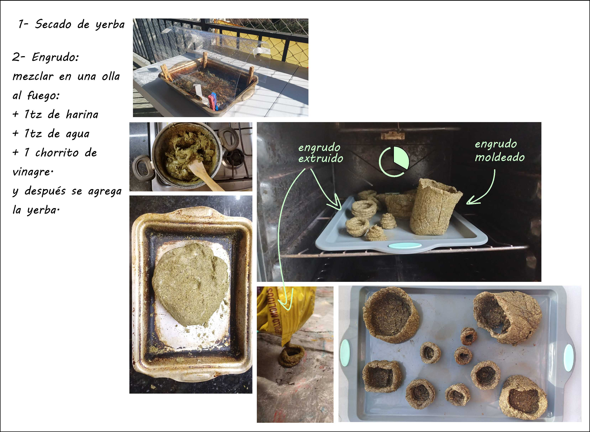
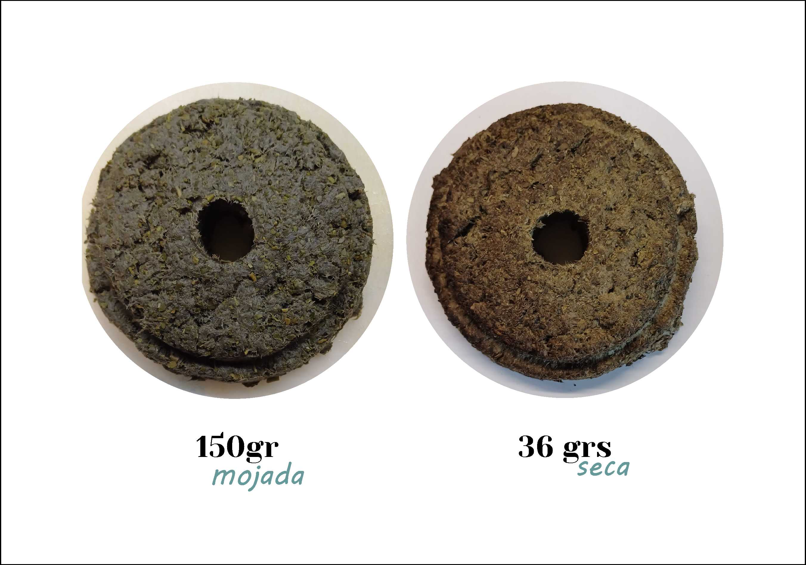
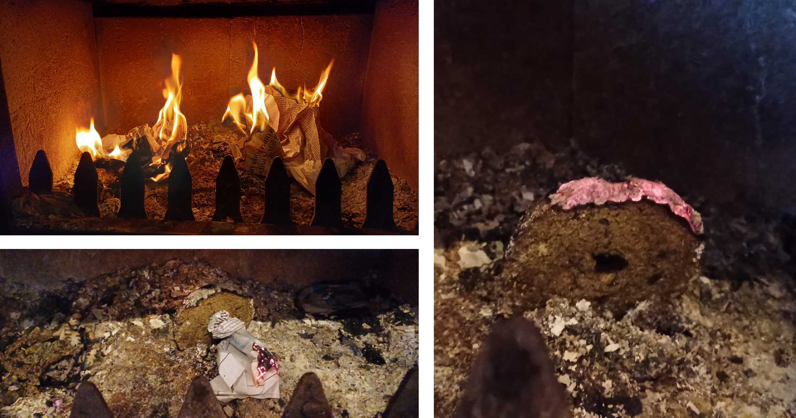

---
hide:
    - toc
---

# Proyecto Final: De Yerba descartada a ladrillo 

En esta sección les voy a compartir mi viaje experimental.

Cómo frase disparadora **"La basura no se define por lo que es, sino por donde está"**, reflexioné cómo encarar el Proyecto. Las categorías de "basura" son tantas que mi primer decisión fué recortar al universo de descarte de alimentos. Pero todavía el espectro era enorme e inabarcable para mi. El desafío fué elegir y justificar con qué descarte iba a trabajar, para eso me hice la pregunta: **De qué alimento es que se genera un gran descarte en Uruguay?"** la respuesta no tardó en llegar: **Yerba mate** 

La yerba mate es por excelencia la bebida uruguaya, por año, en Uruguay se descartan 30000 toneladas de yerba mate (https://america-retail.com/paises/uruguay/uruguay-comercializo-cerca-de-30-mil-toneladas-de-yerba-mate/), lo que equivale al volumen de 43 piscinas olimpicas (chat gpt dixit).

Al ser el compostaje suele ser el destino más común para el descarte de yerba, me aventuré en la búsqueda de otros destinos para la yerba usada y me encontré con tutoriales para hacer macetas biodegradables con yerba: https://www.youtube.com/watch?v=VJqKtygoL5w

Este es el proceso y resultado de las yerba-macetas: 
{ width="600"}

Esta imagen es de diciembre de 2024, las "macetas" estuvieron desde mayo en un balcón abierto, casi a la intemperie:
{ width="600"}

Navegando por la web dí con la investigación del equipo del Conicet de Tandil que transforma el residuo de yerba mate en super capacitores y filtros. https://ri.conicet.gov.ar/handle/11336/184187
Me puse en cuntacto con Florencia Jerez, ingeniera integrande del grupo de investigadores, quien pacientemente me explicó en qué consistía su proyecto. Quedé asombrada con la aplicación que le habían dado al descarte de yerba. Entonces empecé a preguntarme si podría incluir en mi proyecto esta reutilización del material yerba mate. 
Descarté el camino del supercapacitor porque me excedía en cuanto a conocimiento y recursos para experimentar con el mismo. 

Así me adentré en la opción de generar filtros. Y así surgieron las preguntas: Qué voy a filtrar? Donde? Cómo?
Edu me recomendó el proyecto https://foldscope.com/?srsltid=AfmBOoqK8TVP83MzWRCPbcI-0m4j3f4M3F-6JPt7QZJRmYDLn7z8L5Cf para que tenga de referencia.
Otra vez el universo me pareció inabarcable, y por otro lado me resultaba muy complejo para mis recursos.

# Y si desarrollo un biomaterial para imprimir 3d?

A raíz de la inspiradora lecture de Eduardo en julio y recordando la experiencia con el engrudo de las macetas me propuse incursionar en el desarrollo de un biomaterial cuya base sea yerba mate descartada. Me puse en contacto con María Clara, quien me facilitó recetas y me dió varias recomendaciones. Asi me puse manos a la obra y probé las siguientes recetas
Las pruebas las hacía con una jeringa de 20ml. Nunca logré coordinar para ir a probar las pastas en la extrusora adaptada de Utec, entonces abandoné este camino.

Receta 1
Receta 2
etc

Al armar los compuestos me desanimó que el porcentaje de yerba consumido era muy chico en proporción al resto. Y mi trabajo aspira a procesar las 30 toneladas de yerba que se descartan en uy, o por lo menos una cantidad significativa.
También tenía el desafío de encontrar una aplicación que justificara el uso del material, más allá del aprovechamiento del descarte.

Imagen del proceso de preparación de los biomateriales.

Para  preparar los ingredientes, a la yerba había que secarla. Armé una cajitas con papel aluminio para depositar el contenido del mate  consumido y probé varías formas de secado: en el horno, al sol y sobre la estufa a leña. 
El objetivo de recolectar la yerba descartada en porciones me permitía seguir un registro que nunca pude llevar al día. El objetivo de ese **registro** era cuantificar el **peso** de la yerba descartada, la **técnica** de secado, el **tiempo** que requería y el **peso del material seco**.
Lamentablemente no pude llevar un registro muy exacto, realizar este tipo de actividad en un entorno doméstico nos entorpecía la convivencia. Asi es que empecé a acopiar en la heladera y hasta en el freezer.

# Momento Eureka 1

En uno de estos proceso de secado, agupé varias "cajitas" para secar en el horno. Había una que me parecía que ya estaba seca, con el afan de secarla bien la volví a meter al horno. El tiempo promedio de secado de una "cajita" de 170 grs de yerba húmeda.
Y en ese tiempo sucedió que la yerba de la cajita casi seca se carbonizó e incandeció. Salió humo, y tuve la mala idea de sacarla al balcón, era una noche de agosto invernal de viento que avivó el material. Para apagarlo le coloqué un bowl de metal hasta que el oxigeno se acabara y la brasa se extinguiera. Obviamente no hay imágenes porque estuve ocupada.
Asi quedó el material:

{ width="600"}

Entonces surgió una idea: y si hago eco briquetas?

Pero este camino también tenía una pata floja: no me convencía crear algo que emitiera dióxido de carbono (principal gas del efecto invernadero).
Pero no por eso iba a dejar de investigar y experimentar en las recetas de las "eco" leñas. Conocí la movida "from waste to energy" https://www.lanacion.com.ar/lifestyle/de-basura-parrilla-historia-marlo-sustituto-ecologico-nid2526940/ 

Y asi hice una prueba mezclando 800ml de agua, 722grs de pulpa de papel remojado durante 24 hrs y 490grs de yerba húmeda.

{ width="600"}

{ width="600"}

Me llama la atención la liviandad del material resultante, la pieza de 152 grs de la mezcla, pasa a pesar 36 grs despues del secado en la deshidratadora.

Una vez secas las briquetas, las someto a la prueba de fuego (literal)

{ width="600"}

Reflexión de la prueba de fuego: a la briqueta le costó prenderse. Deduzco que la pulpa de papel actúa como retardante.

# Recalculando

No me costó descartar el camino del desarrollo de briquetas a partir de yerba después de la fallida prueba. de esta forma me ahorraba el generar un producto que emita CO2.

Cuando compartí con mis compañeros el material obtenido me quedé con la sorpresa que les generó la liviandad y rigidez del material. Me sugirieron aplicarlo para paneles acústicos, y yo me pregunté si no podría transformarse en ladrillo.
Asi me sumergí en el fascinante y mundo de los eco ladrillos que se encuentra en pleno desarrollo.  