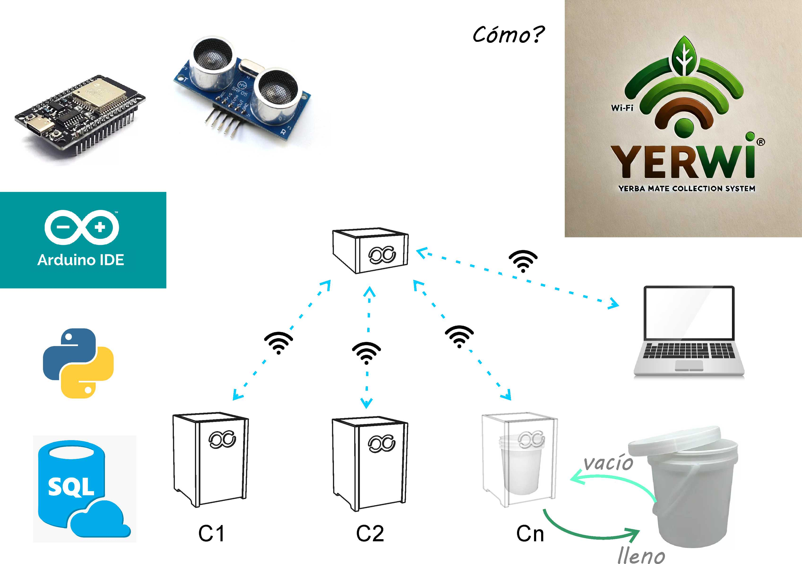

---
hide:
    - toc
---

# Video
https://youtube.com/shorts/-CK_uKd7F_A?feature=share

# Presentacion

Hoy les voy a contar sobre Yersis, el Sistema integral de gestión del residuo yerba mate en Uruguay
Colabora con 4 ODS: #1 Fin de la pobreza, #8 Trabajo decente y crecimiento económico, #9 Industria, innovación e infraestructura, #11 Ciudades y comunidades sostenibles y #12 Producción y Consumo responsable.

Porque la basura no se define por lo que es, si no por donde está, con Yersis me propuse encauzar y aprovechar el descarte de yerba mate en Uruguay, donde el mate es una costumbre tradicional que la mayoría de los habitantes consume. Por año se descarta el equivalente al volumen de 48 piscinas olímpicas. La yerba mate es uno de los residuos orgánicos que más contamina.
Encontré varias iniciativas de programas para compostarla. Entonces me pregunté qué otro destino se le podría dar?, y así empezó un largo camino que devino en esta investigación para el desarrollo de un ladrillo cuyo componente principal, o en cantidad significativa sea el descarte de yerba.

Pero para poder desarrollar el ladrillo también pensé en que tenía que pensar en cómo podía recolectar la yerba. Al ser lo más conveniente recolectar el material en origen me pregunté donde? Cómo convenía hacerlo? Y así surgió Yerco, un contenedor con un subcontenedor intercambiable el cual va a recibir la yerba descartada. El contenedor principal está dotado con un  sensor de distancia y la comunicación a través de la esp 32 es un puente, que sirve para facilitar la vida. Gracias a la electrónica sabés si el tacho está lleno o no, si tenés que ir a buscarlo o no, y eso deviene en ahorro de trabajo porque no tengo que ir a fijarme como está, lo miro sentado y cuando veo que hay 3 llenos, voy y lo reemplazo por uno vacío.
Diagramé el contenedor basándome en que el subcontenedor sea un recipiente que se consigue en plaza, para esta maqueta utilicé un balde de 3,6 ltrs.
Para la carcaza  de contenedor la planteo en que sea en cualquier material en formato placa con un espesor mayor a 12 mm y menor a 25mm. Para darle la forma recomiendo que sea con cnc, pero también puede ser con corte laser. 

Una vez recolectada la yerba se transporta al taller donde va a ser mezclada con otros ingredientes para ser transformada en ladrillo.
Hasta el momento las recetas que más me resultó es 1 parte de yerba humeda (300 grs), 1 parte de papel mojado (290 grs) por más de 24 hrs, ½ parte de fécula de mandioca (200 grs) y 1 lt de aquafava. Se prensa dentro de un molde. Para el molde utilicé la impresión 3d.   

El proyecto todavía tiene un potencial camino por delante, faltan probar diferentes recetas y explorar otras técnicas de conformación de ladrillo.
Imagino al ladrillo de yerba como un generador de puestos de trabajo, y como elemento para construcción de nuevos hogares que colaboren con el fin de la pobreza.

En enero coordiné para ir a hacer prueba en el molde y máquina de Coople  https://coople.uy/