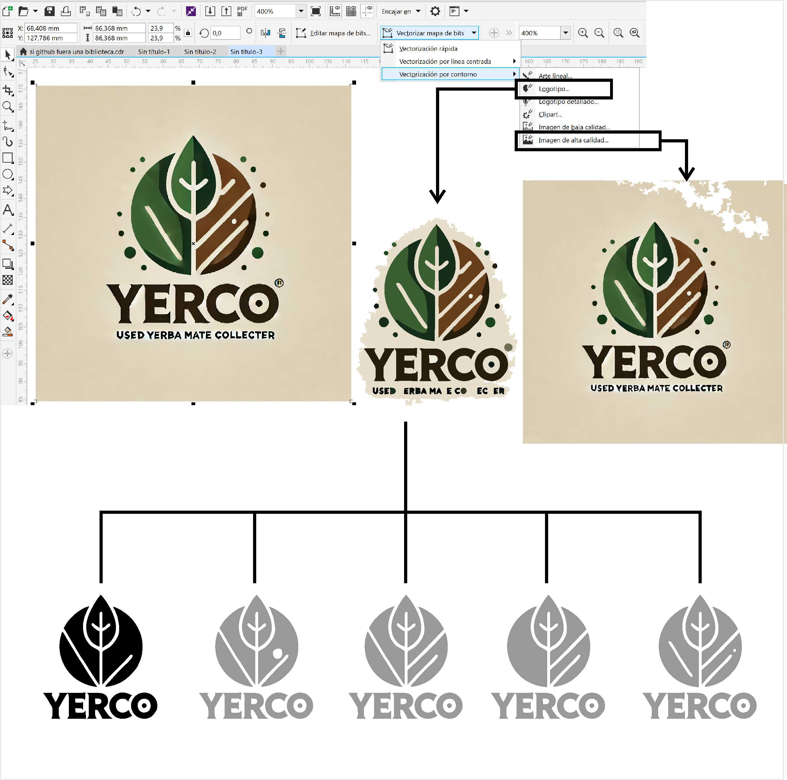
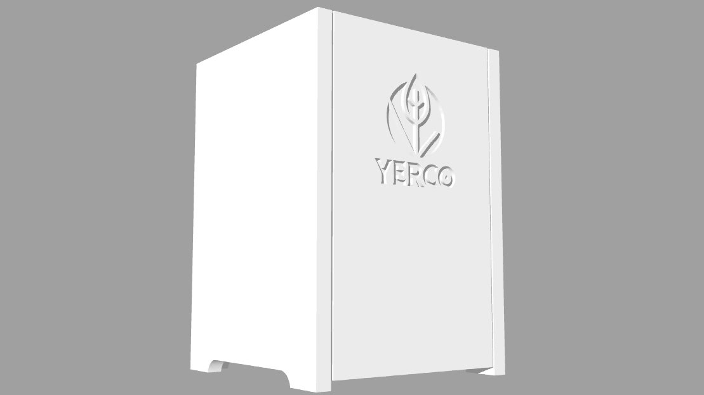
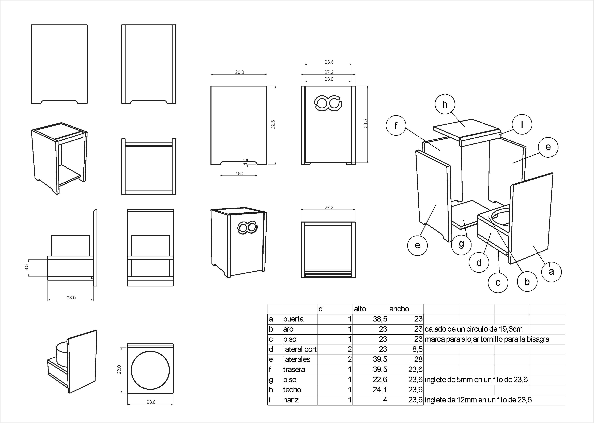

---
hide:
    - toc
---

# MT02 - Diseño 2D y Modelado 3D

## Software 2D y 3D

En este modulo repasamos los diferentes softwares para generar imágenes 2D y modelar en 3D. Para este módulo yo me sentí muy confiada porque es donde más experiencia tengo, gracias a mi cursada de algunas materias de la carrera Diseño Gráfico y de la carrera de Diseño Industrial. Pero después de las clases terminé de confirmar que estoy muy desactualizada (durante los últimos 10 años los usé muy poco) y fuera de práctica.
Identifiqué mis vicios de seguir usando los programas con los que más cómoda me siento: corel draw y rhinoceros. Tomo esta actividad como desafío para incorporar los "nuevos" (para mi) softwares en mis próximos proyectos.

Me pareció especialmente interesante la sección de Diseño Generativo.

Creo que este módulo se podría complementar con herramientas de renderizado.

## Tarea

1_ Generar logo vectorial a partir de una imagen pixelar. 
   Le pedí a chat gpt que me haga un logo para la familia de productos de mi proyecto final. En este caso el logo es con la palabra YERCO, es para el contenedor de recolección de yerba descartada.
   De la imagen propuesta por IA, la vectoricé y sinteticé a mi criterio. La herramienta dall-e me resulta un buen disparador de idea.

   Para hacerlo importe la imagen en corel draw y la vectoricé con la herramienta *vectorizar mapa de bits*, *vectorización por contorno*, y de la opciones elegí los preseteado de *logotipo* e *imagen de alta calidad*. Comparé los resultados, y elegí trabajar con el de *logotipo* porque tenía menos objetos. A raíz de eso, probé un 4 alternativas editando los nodos hasta dar con una versión que me pareció que cumple los requisitos de sintesis suficiente para ser fabricado digitalmente.

2_ Modelador 3D, tuve la intención de hacerlo en Fusion, pero terminé modelando en Rhino (mi viejo conocido) 
Modelé el contenedor en función de los componentes electrónicos y de del contenedor primario que conseguí en plaza, un "balde" de 3,6 lts.

3_ Aplicación del logo vectorizado.
Exporté el logo en pdf, que importé en rhino. El cual extruí con tapa, y procedí a sustraerlo de la puerta del frente.

4_ Imagen del objeto diseñado.

Solía usar Keyshot para renderizar, pero se me desinstaló de la máquina en una de las tantas reparaciones y aún no volví a instalarlo. Y de hecho, mi computadora está necesiando un service urgente. 
Para este itema de la tarea, me limité a renderizar con la función de rhino. Muy pobre el resultado. Hay mucho más para investigar y actualizarme.

5_ Archivos .stl para la impresión 3D.

[.stl](../archivos/Pilar%20Garcia%20Olano_ModeloMT05_EFDI.stl)

6_ Lamina de presentación. Esta lamina la edité con corel draw.

