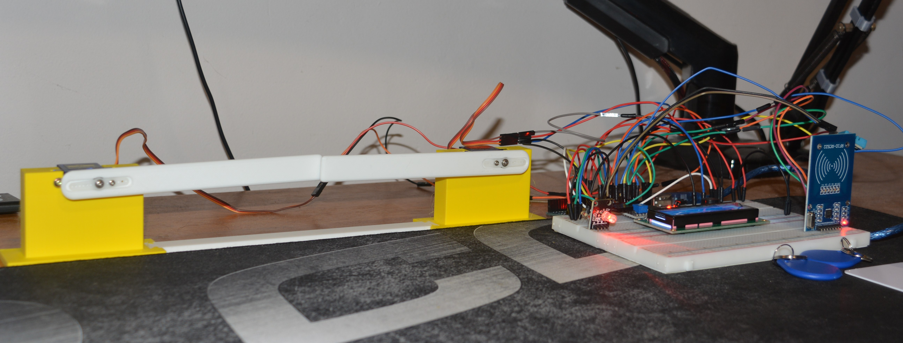
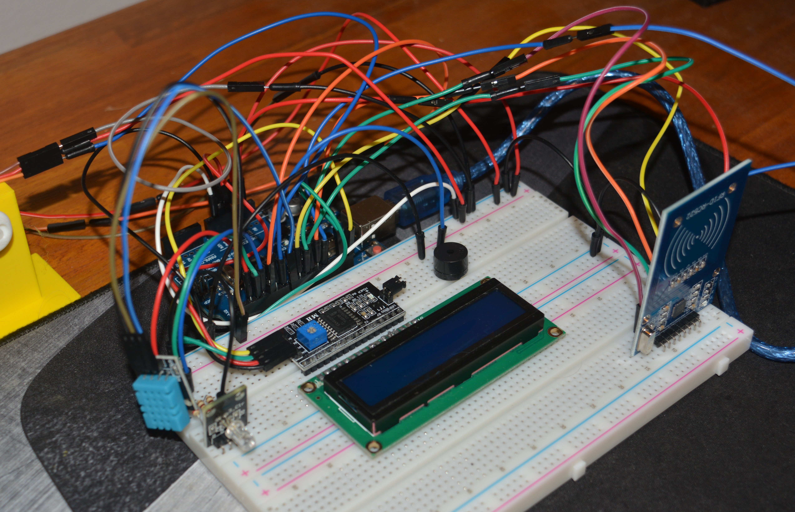
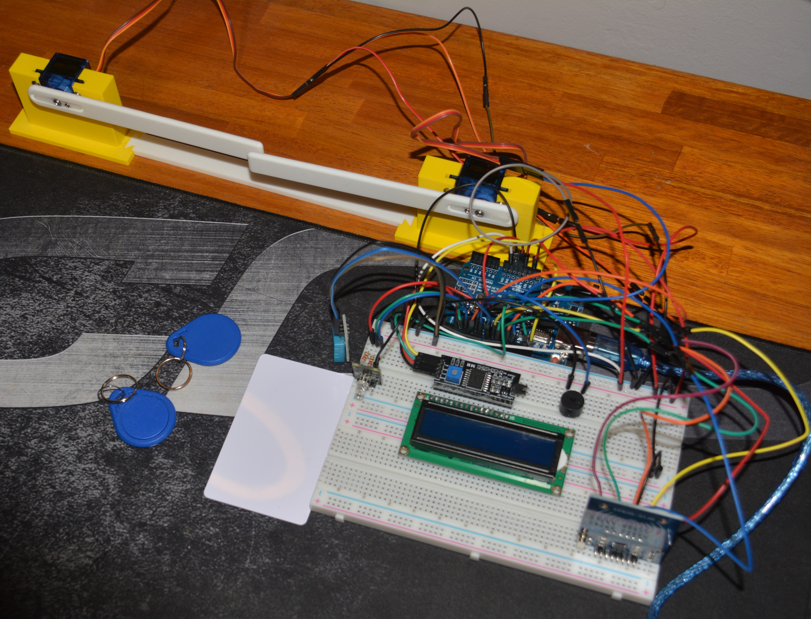

---
hide:
    - toc
---

# MT04 - Introducción a la Electrónica y Programación (Arduino IDE)

## Introducción

El módulo de Introducción a la Electrónica y Programación es una parte fundamental del eje de tecnología y fabricación, que busca llevarnos más allá de la teoría y sumergirnos en la aplicación práctica de la tecnología, para esto, en este módulo, nos enfocaremos en el mundo de la electrónica y la programación utilizando Arduino, una plataforma abierta y accesible que ha revolucionado la forma en que aprendemos y aplicamos estas disciplinas. Desde el primer día, trabaja con componentes electrónicos básicos, como resistencias, LEDs y sensores, y aprende a programar microcontroladores usando el entorno de desarrollo Arduino IDE.Este módulo es una puerta de entrada al fascinante mundo de la electrónica y la programación, una oportunidad para explorar, aprender y crear. Personalmente, lo que más me llama la atención es la posibilidad que da la placa programable para implementar diferentes sensores, que darán vida a cualquier proyecto donde la incluyamos.

Para llevar a cabo este módulo vimos diferentes herramientas como lo son: 

## Arduino

{ align=left }

Arduino es una plataforma de código abierto que combina hardware y software para facilitar la creación de proyectos de electrónica y programación. Diseñada para ser accesible tanto para principiantes como para profesionales, Arduino permite a los usuarios construir dispositivos interactivos que pueden percibir y controlar objetos en el mundo físico.

El núcleo del ecosistema Arduino es la placa Arduino, un microcontrolador que actúa como el cerebro de tus proyectos. Existen varios modelos de placas, como Arduino Uno, Arduino Mega y Arduino Nano, cada una con diferentes capacidades y características para adaptarse a una amplia gama de aplicaciones. Estas placas están equipadas con pines de entrada y salida que permiten la conexión con diversos componentes electrónicos como sensores, LEDs, motores y más.

Entre las aplicaciones típicas de Arduino se encuentran la robótica, donde puedes construir y programar robots para realizar diversas tareas, y la domótica, donde puedes automatizar dispositivos y sistemas en el hogar. También se utiliza ampliamente en la educación, proporcionando a estudiantes y educadores una herramienta práctica para aprender sobre electrónica, programación y diseño de sistemas.

## Arduino IDE

{ align=left }

El Arduino IDE (Entorno de Desarrollo Integrado) es una herramienta de software esencial para programar las placas Arduino. Diseñado para ser accesible tanto para principiantes como para usuarios avanzados, el Arduino IDE proporciona un entorno sencillo y eficiente para escribir, compilar y cargar programas (conocidos como "sketches") en las placas Arduino.

La interfaz del Arduino IDE es intuitiva y fácil de usar. En su núcleo, ofrece un editor de código donde los usuarios pueden escribir sus programas utilizando un lenguaje basado en C/C++. Este editor incluye características útiles como el resaltado de sintaxis y la numeración de líneas, lo que facilita la lectura y el desarrollo del código.

Una de las funcionalidades clave del Arduino IDE es su compilador incorporado, que convierte el código escrito en un formato que puede ser entendido y ejecutado por el microcontrolador de la placa Arduino. Una vez compilado, el programa se puede cargar fácilmente en la placa a través de una conexión USB, permitiendo una programación rápida y directa.

El Arduino IDE también incluye una amplia biblioteca de funciones y ejemplos predefinidos que ayudan a los usuarios a empezar con sus proyectos. Estas bibliotecas abarcan una gran variedad de funcionalidades, desde la manipulación de LEDs hasta el control de motores y la lectura de sensores, facilitando la incorporación de diversas capacidades en los proyectos.

## Kit de Arduino

{ align=left }

Un kit de Arduino es un conjunto completo de herramientas y componentes diseñados para aprender y desarrollar proyectos de electrónica y programación de manera práctica. En su núcleo, el kit incluye una placa Arduino, que actúa como el cerebro del sistema. Esta placa es un microcontrolador que se puede programar para interactuar con el mundo exterior a través de diversos sensores y actuadores.

Además de la placa Arduino, el kit viene con una variedad de componentes básicos como resistencias, LEDs, y botones. Estos componentes son fundamentales para construir circuitos simples y entender los principios básicos de la electrónica. También se incluyen sensores, que permiten que el Arduino detecte el entorno. Estos pueden ser sensores de temperatura, luz, movimiento, entre otros.

Para dar vida a los proyectos, el kit incluye actuadores como motores, servos y relés, que permiten que el Arduino realice acciones físicas en respuesta a los datos que recibe de los sensores. Los cables y conectores, como los jumper wires y las placas de prueba (breadboards), facilitan la conexión de todos estos componentes sin necesidad de soldadura.

## Tinkercad Circuits

{ align=left }

Tinkercad Circuits es una plataforma en línea que permite a los usuarios diseñar y simular circuitos electrónicos de manera virtual. Es una herramienta ideal tanto para principiantes como para entusiastas de la electrónica, ya que ofrece un entorno intuitivo y fácil de usar para aprender y experimentar con circuitos sin necesidad de componentes físicos.

La plataforma incluye una variedad de componentes electrónicos que se pueden arrastrar y soltar en un espacio de trabajo virtual. Estos componentes incluyen resistencias, LEDs, botones, potenciómetros, motores, sensores y muchos más. Tinkercad Circuits también permite la integración de microcontroladores como el Arduino, permitiendo a los usuarios escribir y simular código en un entorno seguro y controlado.

## Proceso Realizado

Para la actividad del MT04, se nos solicitaba realizar un ejercicio para poner en práctica los conocimientos adquiridos en el módulo, realizando una actividad con dos consignas: utilizar dos inputs y dos outputs, para ello se me ocurrió diseñar un sistema de parking con activación mediante NFC, utilizando lo siguiente:

Inputs:

1. Lector RFID RC522.

<figure markdown="span">
  { width="600"}
</figure>

2. Sensor de Humedad y Temperatura DHT11.

<figure markdown="span">
  { width="600"}
</figure>

Outputs:

1. Led RGB 3_C1r.

<figure markdown="span">
  { width="600"}
</figure>

2. LCD i2C.

<figure markdown="span">
  { width="600"}
</figure>

3. Buzzer

<figure markdown="span">
  { width="600"}
</figure>

4. Dos servomotores SG90.

<figure markdown="span">
  { width="600"}
</figure>

<figure markdown="span">
  { width="600"}
</figure>

La finalidad de enbarcarme en un proyecto donde necesitaría algunos componentes más, fue con la finalidad de interiorizarme con distintos componentes, de manera tal de tomar contacto con el IDE de Arduino, con la placa y con los diferentes componentes. De manera que si necesito utilizar los mismos o similares de cara al proyecto final, tenga la práctica y el conocimiento de utilizar lo anteriormente mencionado, por otro lado, también el hecho de que si necesite hacer uso de otro nuevo componente, tenga la base solida, construida por la práctica para poder hacerlo.

Antes de comenzar a trabajar me vi dos veces todos los videos explicativos de Mateo de como funcionaba Arduino, el IDE y los sensores, así como las clases de electrónica que tuvimos con Josep.

Primero lo que realicé es el diseño de las barreras y los soportes para los servomotores, luego lo imprimí en la impresora 3d, obteniendo así el objeto físico para armar la barrera de paso completa.
Luego, con todos los componentes reunidos del Kit, me puse a interconectar cada uno con la placa Arduino, resultándome:

## Esquema de Conexión del Proyecto

Para efectos de aclarar, el esquema presentado se basa en los siguiente:
(PIN_DEL_COMPONENTE) -> (PIN_DEL_ARDUINO)

Lector RFID RC522:

1. SDA-> PIND 10
2. SCK -> PIND 13
3. MOS -> PIND 11
4. IMI -> PIND 12
5. GND -> GND
6. RST -> PIND 9

(PIN RQ se deja libre)

Sensor de Humedad y Temperatura DHT11:

1. GND -> GND
2. VCC -> 5V
3. S -> PIND 8

Led RGB 3_C1r:

1. R -> PIND 2
2. G -> PIND 3
3. B -> PIND 4
4. GND -> GND

LCD i2C:

1. GND -> GND
2. VCC -> 5V
3. SDA -> SDA
4. SCL -> SCL

Buzzer:

1. POS -> PIND 7
2. GND -> GND

Servomotores SG90:

Izquierdo:

1. POT -> 5V
2. GND -> GND
3. S -> PIND 5

Derecho:

1. POT -> 5V
2. GND -> GND
3. S -> PIND 6

## Imagenes del Proyecto

<figure markdown="span">
  { width="600"}
</figure>

<figure markdown="span">
  { width="600"}
</figure>

<figure markdown="span">
  { width="600"}
</figure>

<figure markdown="span">
  { width="600"}
</figure>

<figure markdown="span">
  { width="600"}
</figure>

<figure markdown="span">
  { width="600"}
</figure>

## Videos del Proyecto

Muestra del proyecto en general:

<iframe width="1903" height="750" src="https://www.youtube.com/embed/khJM-7zkbLs" title="Proyecto MT04 - EFDI - NDQ - Paneo del Proyecto en Arduino UNO" frameborder="0" allow="accelerometer; autoplay; clipboard-write; encrypted-media; gyroscope; picture-in-picture; web-share" referrerpolicy="strict-origin-when-cross-origin" allowfullscreen></iframe>

Muestra del proyecto en funcionamiento:

<iframe width="1903" height="750" src="https://www.youtube.com/embed/NoPmlJcwsWE" title="Proyecto MT04 - EFDI - NDQ - Muestra de Funcionamiento del Proyecto en Arduino UNO" frameborder="0" allow="accelerometer; autoplay; clipboard-write; encrypted-media; gyroscope; picture-in-picture; web-share" referrerpolicy="strict-origin-when-cross-origin" allowfullscreen></iframe>

## Conclusiones del Proyecto

El módulo MT04: Introducción a la Electrónica y Programación (Arduino IDE) ha sido una experiencia formativa y transformadora que ha ampliado significativamente mis conocimientos y habilidades en el campo de la electrónica y la programación. Durante el transcurso, he tenido la oportunidad de trabajar con diversos componentes electrónicos y aprender a integrarlos a través de la plataforma Arduino, lo cual me ha proporcionado una comprensión práctica y teórica de cómo funcionan estos sistemas.

Uno de los puntos culminantes de este módulo fue la realización de una práctica que ayudará a la integración de todo esto directamente en mi proyecto final. En esta práctica, desarrollé un sistema de apertura de puertas para un parking utilizando una combinación de componentes electrónicos. El proyecto incluyó dos servomotores para el control de las puertas, un sensor DHT11 para la medición de temperatura y humedad, un LCD I2C para la visualización de información, un Arduino Uno como el cerebro del sistema, un LED RGB para señales visuales y un sensor RFID para la identificación y autorización de acceso.

Este proyecto no solo me permitió aplicar los conceptos teóricos aprendidos en el módulo, sino que también me enfrentó a desafíos prácticos que me ayudaron a mejorar mis habilidades de resolución de problemas. La integración de los servomotores para el movimiento preciso de las puertas, la implementación del sensor DHT11 para monitorear las condiciones ambientales, y el uso del LCD I2C para mostrar datos relevantes fueron aspectos clave que me proporcionaron una comprensión más profunda de cómo diseñar y construir sistemas electrónicos más complejos.

Además, el uso del sensor RFID fue particularmente instructivo, ya que me permitió explorar las posibilidades de seguridad y control de acceso en aplicaciones del mundo real. Este componente añadió una capa de funcionalidad avanzada a mi proyecto, permitiendo la identificación y autorización automática de usuarios en el sistema de apertura.

La práctica de este módulo no solo me ha equipado con las habilidades técnicas necesarias para completar mi proyecto final, sino que también ha fortalecido mi capacidad para pensar críticamente y diseñar soluciones innovadoras. El conocimiento adquirido en este módulo será fundamental para el éxito de mi proyecto final y más allá, proporcionando una base sólida sobre la cual puedo construir futuros proyectos en el campo de la electrónica y la programación.

El módulo MT04 ha sido una experiencia invaluable que ha enriquecido mi formación en la especialización de Fabricación Digital e Innovación. Estoy emocionado por aplicar lo aprendido en mi proyecto final y seguir explorando las posibilidades ilimitadas que ofrece la tecnología Arduino.

## Archivos del Proyecto

*[Proyecto de Arduino IDE](../archives/EFDI-MT04-NDQ.rar)*

*[Proyecto Bambú Studio (Perfil de Impresión y STLS)](../archives/MT04-NDQ-EFDI.3mf)*
