---
hide:
    - toc
---

# MT06 - Networking

## Introducción

El módulo MT06, de Networking ha sido una experiencia enriquecedora, donde no solo profundizamos en conceptos técnicos, sino que también exploramos el mundo de la conectividad y la automatización mediante dispositivos IoT. Personalmente, fue un recorrido en el que tuve la oportunidad de experimentar de primera mano cómo las tecnologías de redes y microcontroladores pueden integrarse para crear soluciones.

Trabajamos con el ESP32, una de mis placas favoritas por su versatilidad y capacidad de conectarse a redes Wi-Fi y Bluetooth. El hecho de poder programarla desde el Arduino IDE, una herramienta que ya conocía, hizo que todo el proceso fuera mucho más fluido y accesible. Pero lo más interesante fue utilizar Wokwi, una plataforma, que no conocía, de simulación que me permitió diseñar y probar proyectos sin la necesidad de tener el hardware duplicado en mis manos. Esto abre las puertas para experimentar sin temor a equivocarme y sin limitaciones físicas, algo que cambia y ayuda a la perspectiva sobre el desarrollo de proyectos.

Además, el uso del protocolo MQTT fue clave en este módulo. Antes de este curso, sabía de su existencia, pero no había tenido la oportunidad de ponerlo en práctica. Descubrí cómo puede facilitar la comunicación entre dispositivos en redes IoT de manera eficiente, especialmente en proyectos donde el consumo de recursos es importante y la estabilidad de la red no siempre está garantizada.

En este módulo el tutor fue Josep Martí.

Para llevar a cabo este módulo vimos diferentes herramientas como lo son: 

## Arduino IDE

{ align=left }

El Arduino IDE (Entorno de Desarrollo Integrado) es una herramienta de software esencial para programar las placas Arduino. Diseñado para ser accesible tanto para principiantes como para usuarios avanzados, el Arduino IDE proporciona un entorno sencillo y eficiente para escribir, compilar y cargar programas (conocidos como "sketches") en las placas Arduino.

La interfaz del Arduino IDE es intuitiva y fácil de usar. En su núcleo, ofrece un editor de código donde los usuarios pueden escribir sus programas utilizando un lenguaje basado en C/C++. Este editor incluye características útiles como el resaltado de sintaxis y la numeración de líneas, lo que facilita la lectura y el desarrollo del código.

Una de las funcionalidades clave del Arduino IDE es su compilador incorporado, que convierte el código escrito en un formato que puede ser entendido y ejecutado por el microcontrolador de la placa Arduino. Una vez compilado, el programa se puede cargar fácilmente en la placa a través de una conexión USB, permitiendo una programación rápida y directa.

El Arduino IDE también incluye una amplia biblioteca de funciones y ejemplos predefinidos que ayudan a los usuarios a empezar con sus proyectos. Estas bibliotecas abarcan una gran variedad de funcionalidades, desde la manipulación de LEDs hasta el control de motores y la lectura de sensores, facilitando la incorporación de diversas capacidades en los proyectos.

## Wokwi

{ align=left }

Wokwi es una plataforma en línea para simular proyectos de electrónica y programación con placas como Arduino, ESP32 y otros microcontroladores. Ofrece un entorno virtual donde los usuarios pueden diseñar, programar y probar circuitos electrónicos sin necesidad de hardware físico, lo que facilita la experimentación y el aprendizaje en proyectos de IoT y automatización.

En Wokwi, los usuarios pueden escribir y cargar programas utilizando lenguajes basados en C/C++, como lo harían en el Arduino IDE, y ver en tiempo real cómo sus circuitos se comportan. Además, el simulador permite la interacción con componentes electrónicos como LEDs, sensores, motores, displays, y otros dispositivos, proporcionando una experiencia cercana a trabajar con hardware real.

Una de las características más útiles de Wokwi es su compatibilidad con bibliotecas y ejemplos de Arduino, ESP32, y Raspberry Pi Pico, lo que permite a los usuarios replicar y modificar proyectos fácilmente. La plataforma también incluye herramientas de depuración y visualización, ayudando a los usuarios a identificar problemas en sus programas y circuitos.

## Placa ESP32

{ align=left }

El ESP32 es un microcontrolador de bajo costo y alto rendimiento que integra conectividad Wi-Fi y Bluetooth, siendo una excelente opción para proyectos de IoT (Internet of Things) y aplicaciones inalámbricas. Este microcontrolador, desarrollado por Espressif Systems, ofrece más capacidad y versatilidad en comparación con las tradicionales placas Arduino, permitiendo su uso en proyectos más complejos y exigentes.

La placa ESP32 se puede programar utilizando el Arduino IDE, lo que facilita su adopción para quienes ya están familiarizados con este entorno de desarrollo. Al igual que otras placas Arduino, el ESP32 se programa en un lenguaje basado en C/C++, y puede utilizar las mismas bibliotecas, aunque también ofrece soporte para bibliotecas adicionales diseñadas específicamente para aprovechar sus capacidades avanzadas de conectividad.

El ESP32 destaca por su capacidad de trabajar en redes Wi-Fi y Bluetooth simultáneamente, lo que permite crear dispositivos conectados que pueden comunicarse entre sí y con el entorno. Además, cuenta con una gran cantidad de pines de entrada/salida (GPIO), que permiten la conexión de múltiples sensores, actuadores y periféricos, así como la posibilidad de implementar comunicaciones SPI, I2C y UART.

## Kit de Arduino

{ align=left }

Un kit de Arduino es un conjunto completo de herramientas y componentes diseñados para aprender y desarrollar proyectos de electrónica y programación de manera práctica. En su núcleo, el kit incluye una placa Arduino, que actúa como el cerebro del sistema. Esta placa es un microcontrolador que se puede programar para interactuar con el mundo exterior a través de diversos sensores y actuadores.

Además de la placa Arduino, el kit viene con una variedad de componentes básicos como resistencias, LEDs, y botones. Estos componentes son fundamentales para construir circuitos simples y entender los principios básicos de la electrónica. También se incluyen sensores, que permiten que el Arduino detecte el entorno. Estos pueden ser sensores de temperatura, luz, movimiento, entre otros.

Para dar vida a los proyectos, el kit incluye actuadores como motores, servos y relés, que permiten que el Arduino realice acciones físicas en respuesta a los datos que recibe de los sensores. Los cables y conectores, como los jumper wires y las placas de prueba (breadboards), facilitan la conexión de todos estos componentes sin necesidad de soldadura.

## Protocolo MQTT

{ align=left }

El MQTT (Message Queuing Telemetry Transport) es un protocolo de mensajería ligero diseñado para comunicaciones de máquina a máquina (M2M) y aplicaciones IoT (Internet of Things). Gracias a su bajo consumo de ancho de banda y recursos, MQTT es ideal para dispositivos conectados en entornos con limitaciones de red o hardware, como sensores remotos o sistemas embebidos.

Este protocolo sigue un modelo de publicación-suscripción, donde los dispositivos ("publicadores") envían mensajes a un servidor central o "broker", y los dispositivos interesados ("suscriptores") reciben solo los mensajes relevantes para ellos. Esta arquitectura flexible permite que múltiples dispositivos se comuniquen sin necesidad de estar conectados entre sí de manera directa.

Una de las grandes ventajas de MQTT es su eficiencia. Está diseñado para trabajar con conexiones inestables o intermitentes, lo que lo hace muy adecuado para aplicaciones donde la confiabilidad y la estabilidad de la red no están garantizadas. Además, MQTT utiliza un sistema de calidad de servicio (QoS) configurable, que permite a los desarrolladores elegir el nivel de confiabilidad que desean para la entrega de los mensajes, desde la mejor entrega posible hasta una entrega garantizada.

MQTT es ampliamente utilizado en sistemas de automatización del hogar, monitoreo remoto, vehículos conectados, y cualquier aplicación que requiera el envío de datos en tiempo real entre dispositivos con recursos limitados. Su integración con microcontroladores como el ESP32 o las placas Arduino permite crear soluciones IoT de bajo costo, eficientes y escalables.

## Proceso Realizado

Para la actividad del MT06, se nos solicitaba realizar un ejercicio práctico para aplicar los conocimientos adquiridos en el módulo, siguiendo varias consignas clave. El objetivo era leer un input desde un dispositivo como un botón, sensor o potenciómetro, y publicar los datos obtenidos a través del protocolo MQTT. Luego, debíamos suscribirnos a la publicación del input de uno de nuestros compañeros o bien simular en Wokwi y utilizar esa información para controlar un actuador, como un servomotor o un LED.

En mi caso realicé un proyecto fisico con 3 LEDS, un buzzer y un botón, donde en base a lo que recibe por MQTT del proyecto de Wokwi(un led y un DTH22), lee dicho mensaje y prende un led indicativo de la temperatura, azul, amarillo o rojo (en el caso del rojo emite una señal sonora mediante el buzzer),aquí debajo detallaré los pasos seguidos:

## Proyecto Físico

Inputs:

1. Botón

<figure markdown="span">
  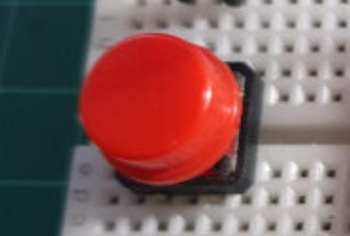{ width="600"}
</figure>

Outputs:

1. LEDs.

<figure markdown="span">
  { width="600"}
</figure>

2. Buzzer

<figure markdown="span">
  { width="600"}
</figure>

## Proyecto Wokwi

Inputs:

1. Sensor de Humedad y Temperatura DHT22.

<figure markdown="span">
  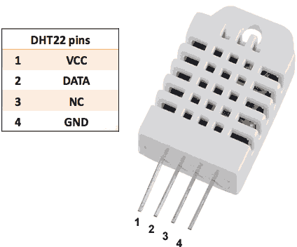{ width="600"}
</figure>

Outputs:

1. LEDs.

<figure markdown="span">
  { width="600"}
</figure>

## Esquema de Conexión del Proyecto Físico

Para efectos de aclarar, el esquema presentado se basa en los siguiente:
(PIN_DEL_COMPONENTE) -> (PIN_DEL_ESP32)

Botón:

1. GND -> GND
2. POS -> D5

LEDs:

1. GND -> GND
2. POS -> D26 (LED Amarillo)
3. POS -> D4 (LED Rojo)
4. POS -> D27 (LED Azul)

Buzzer:

1. POS -> D21
2. GND -> GND

## Esquema de Conexión del Proyecto Wokwi

Para efectos de aclarar, el esquema presentado se basa en los siguiente:
(PIN_DEL_COMPONENTE) -> (PIN_DEL_ESP32)

Sensor de Humedad y Temperatura DHT11:

1. GND -> GND
2. VCC -> 3V
2. SDA -> D15

LED:

1. GND -> GND
4. POS -> D13 (LED Azul)

## Imagenes del Proyecto Físico

<figure markdown="span">
  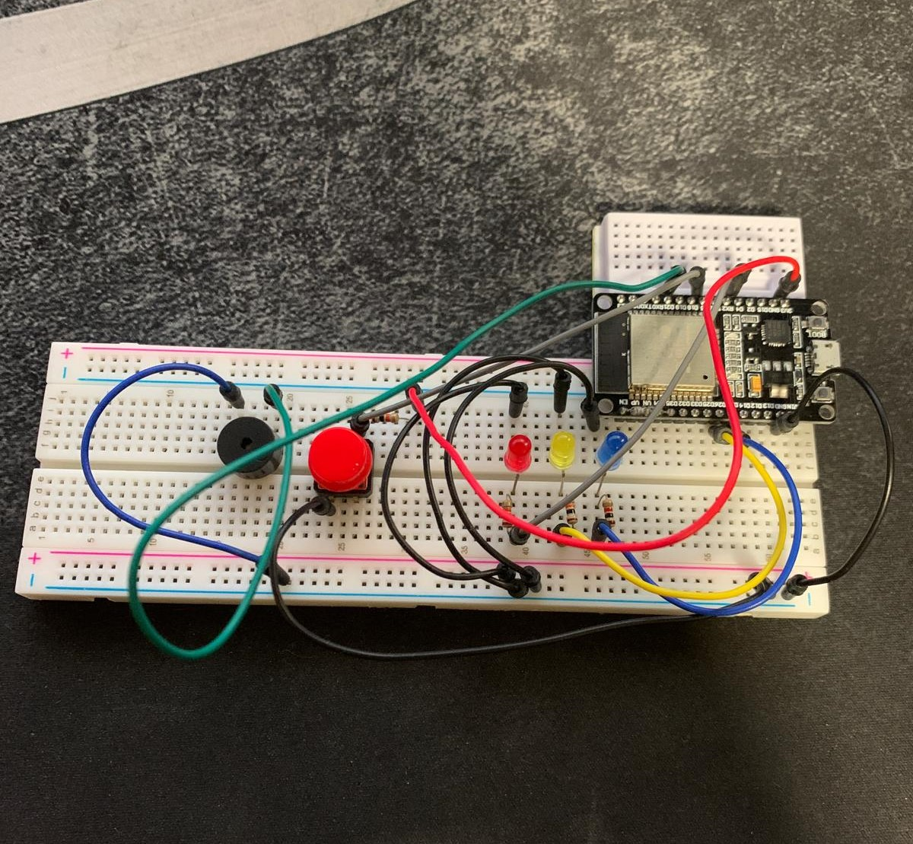{ width="600"}
</figure>

<figure markdown="span">
  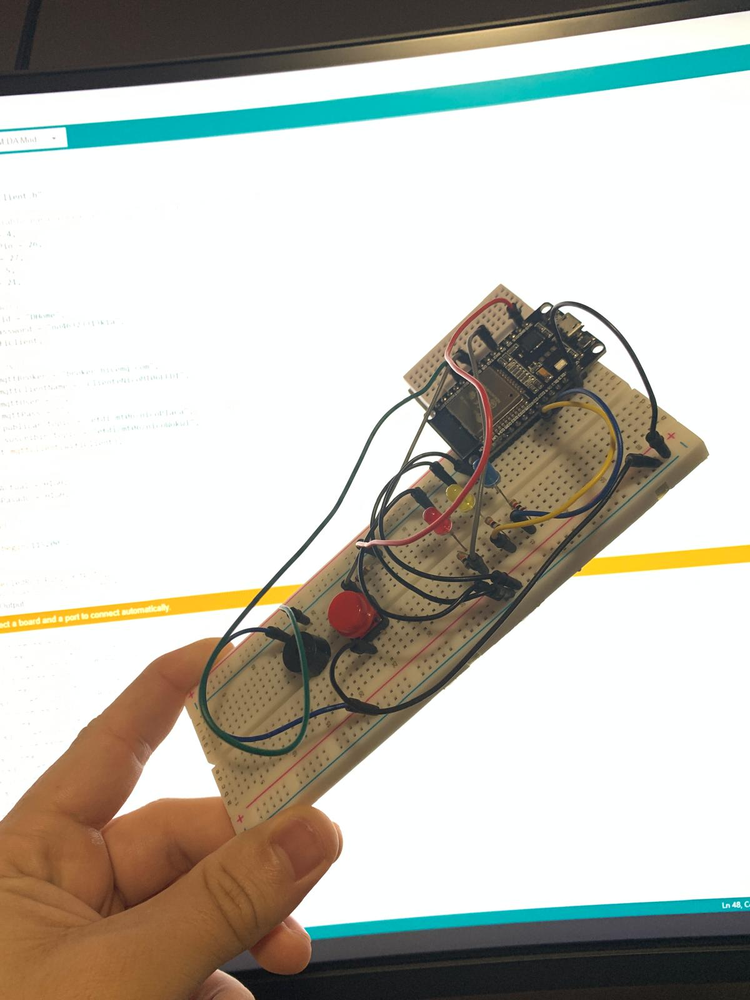{ width="600"}
</figure>

<figure markdown="span">
  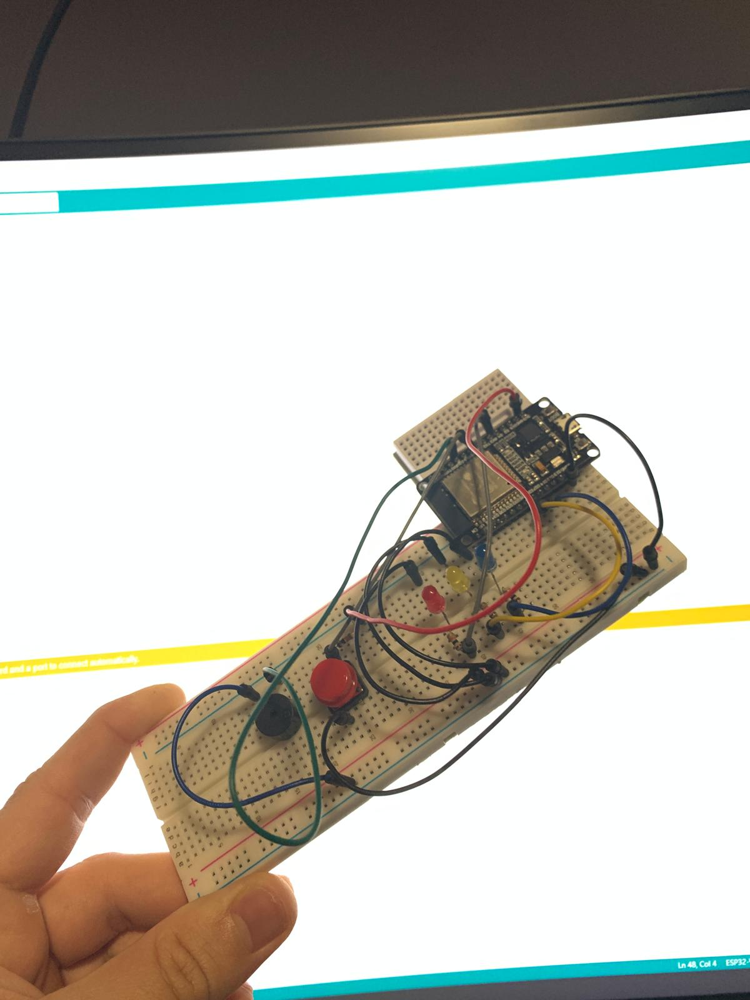{ width="600"}
</figure>

<figure markdown="span">
  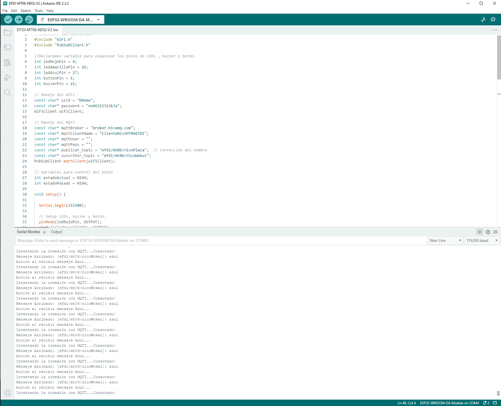{ width="600"}
</figure>

## Código del Proyecto Físico

<figure markdown="span">
  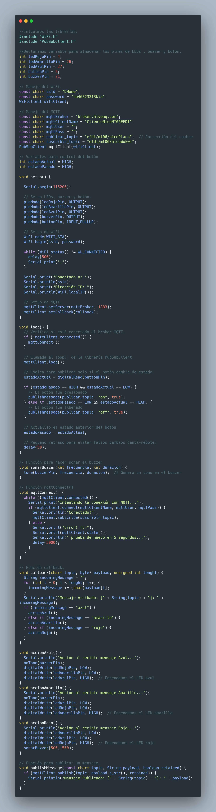{ width="600"}
</figure>

## Imagenes del Proyecto Wokwi

<figure markdown="span">
  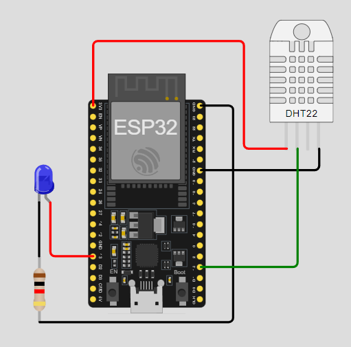{ width="600"}
</figure>

<figure markdown="span">
  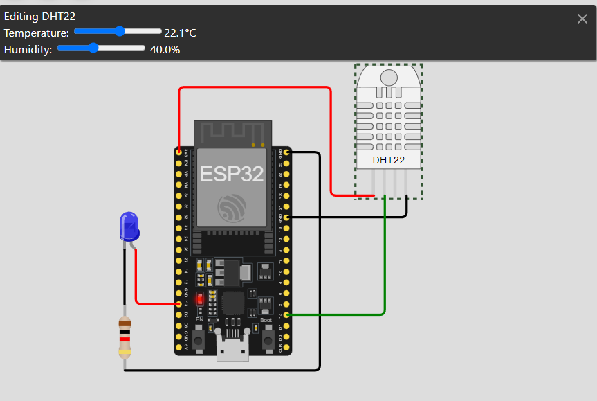{ width="600"}
</figure>

<figure markdown="span">
  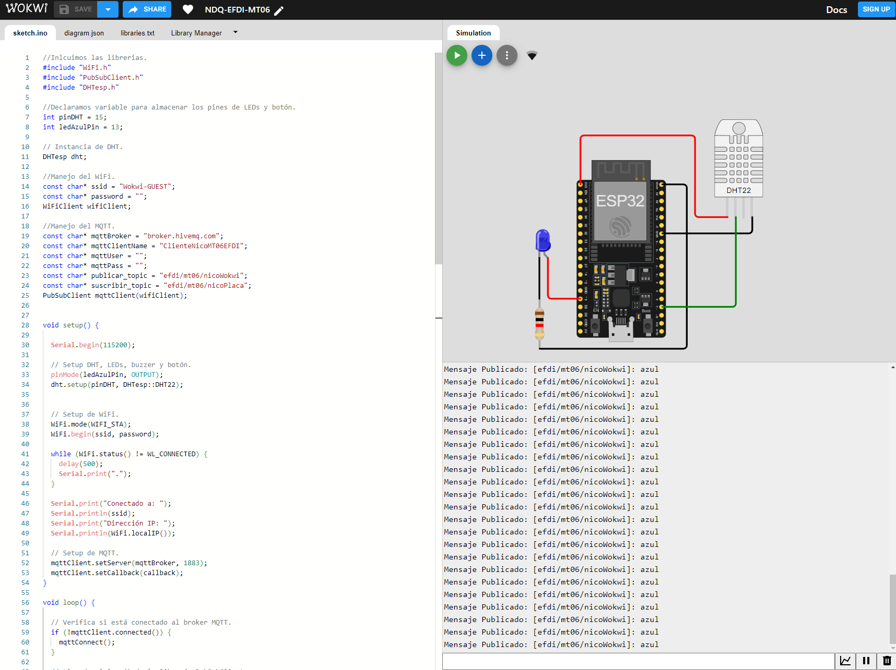{ width="600"}
</figure>

## Código del Proyecto Wokwi

<figure markdown="span">
  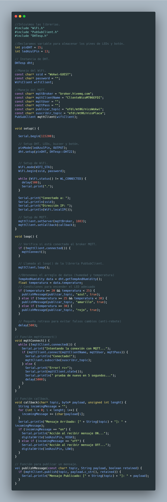{ width="600"}
</figure>

## Imagenes del Ambos Proyectos

<figure markdown="span">
  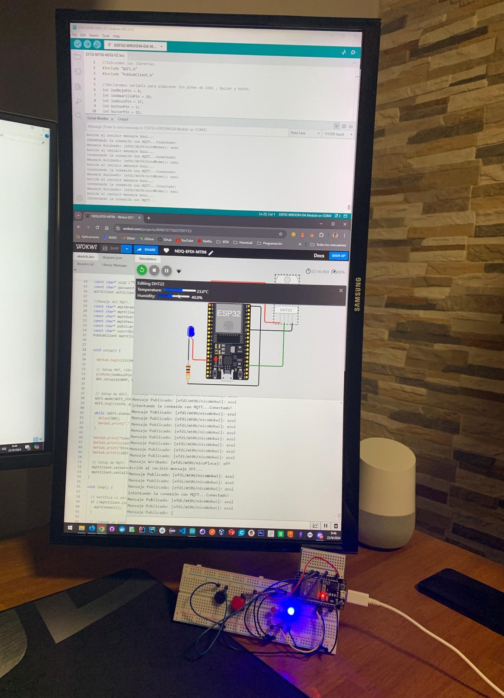{ width="600"}
</figure>

<figure markdown="span">
  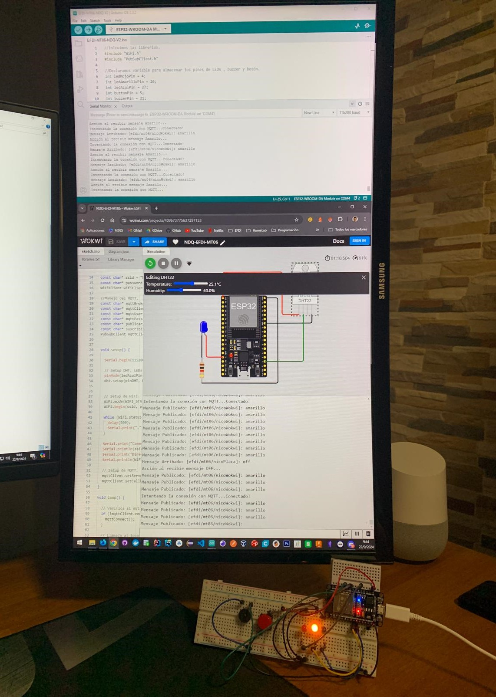{ width="600"}
</figure>

<figure markdown="span">
  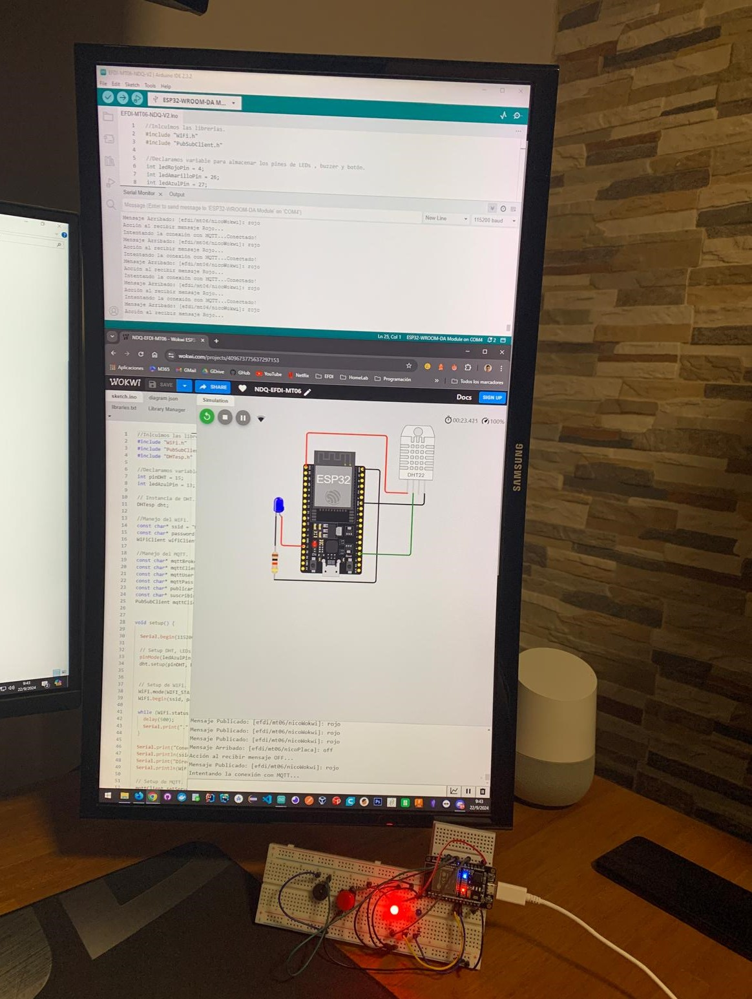{ width="600"}
</figure>

## Videos del Proyecto 

<iframe width="1903" height="750" src="https://www.youtube.com/embed/R_oHdlAssuo?si=I0_R3wqvSd-geaIO" title="Proyecto MT04 - EFDI - NDQ - Paneo del Proyecto en Arduino UNO" frameborder="0" allow="accelerometer; autoplay; clipboard-write; encrypted-media; gyroscope; picture-in-picture; web-share" referrerpolicy="strict-origin-when-cross-origin" allowfullscreen></iframe>

## Conclusiones del Proyecto

En conclusión, el módulo MT06 fue una experiencia muy enriquecedora e interesante para mi, ya que me permitió aplicar de manera práctica conceptos fundamentales sobre conectividad y comunicación en entornos IoT. Trabajar con ESP32, MQTT, y diversos sensores y actuadores me ayudó a entender no solo la teoría detrás de la comunicación de dispositivos, sino también su implementación en proyectos tangibles. La actividad de publicar y suscribirse a datos en tiempo real destacó la importancia de la interoperabilidad y el trabajo colaborativo entre diferentes nodos en una red IoT. Este módulo no solo amplió mis conocimientos técnicos, sino que también reforzó la importancia de pensar en soluciones eficientes y escalables en el contexto del Internet de las Cosas. Me llevo de esta experiencia una base para seguir explorando y desarrollando proyectos más avanzados en el futuro.

## Archivos del Proyecto

*[Proyecto de Arduino IDE](../archives/EFDI-MT06-NDQ-V2.rar)*

*[Proyecto de Wokwi](https://wokwi.com/projects/409673775637297153)*