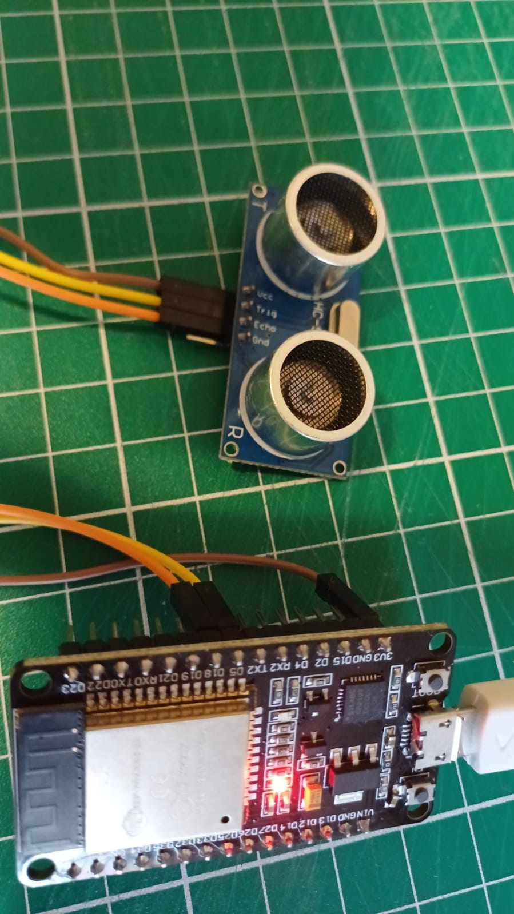

---
hide:
    - toc
---

# MT06 - Networking

[Mi Proyecto en Wokwi](https://wokwi.com/projects/416097928602068993)

Con la ayuda de chap gpt hice el código para programar la placa esp32 con el sensor de distancia para que mida y reporte el nivel de llenado del contendor primario.